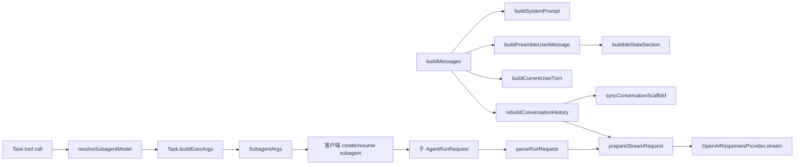

# Cursor++ IDE State、Prompt Cache 与 Subagent 配置：AI 实施交接

## 0. 给接手 AI 的执行指令

本文件是自包含交接资料。不要重新做全仓宽搜，也不要从头重复论坛、日志或架构调查。实施前只需读取本文件列出的目标文件，并确认行号没有因新提交漂移。

执行要求：

1. 仓库根固定为 `/root/CCursor`。
2. 当前基线提交固定为 `fcac85db793fc2c8cda3318b96ec5a41c24f5e26`。
3. 实施计划见 [`IMPLEMENTATION_PLAN.md`](./IMPLEMENTATION_PLAN.md)。
4. 前端目标效果见 [`cursor-plus-subagents-ui.svg`](./cursor-plus-subagents-ui.svg)。
5. 架构流程见 [`cursor-plus-plan.svg`](./cursor-plus-plan.svg)。
6. 不修改主 Agent 模型、Provider 全局默认或各模式的实际执行权限；允许为了缓存稳定永久保留 CreatePlan 等工具定义，但必须由运行时门控。自定义 agent、CPA 和 Desktop/Glass 既有补丁保持不变。
7. 不硬编码 Luna、Max、Fast 或 372000；效果图中的值只是示例。
8. 不在本地运行编译或测试。所有自动验证必须进入 GitHub Actions。
9. 不提交或推送 `package-lock.json`；项目使用 `Cursor++/pnpm-lock.yaml`。
10. 不通过删除旧测试规避回归。
11. 普通 `resume=<existing-agent-id>` 保留现有客户端恢复协议；本次只跳过新的面板覆盖，不发明“空模型一定继承旧模型”的协议。
12. 如果 Mac 客户端忽略 `SubagentArgs.modelParameters`，停止发布并报告，不能假称服务端已闭环。

## 1. 仓库与制品状态

- Git 仓库：`/root/CCursor`
- Git 远端：`git@github.com:austinhmh/CCursor.git`
- 分支：`main`
- 基线：`fcac85db793fc2c8cda3318b96ec5a41c24f5e26`
- package：`Cursor++/package.json`
- Cursor++ version：`0.0.15`
- package manager：pnpm，lockfile 为 `Cursor++/pnpm-lock.yaml`
- 当前业务源码没有因本次交接被修改。

本次应提交的文档制品：

- `IMPLEMENTATION_PLAN.md`
- `AI_IMPLEMENTATION_HANDOFF.md`
- `cursor-plus-plan.svg`
- `cursor-plus-subagents-ui.svg`

## 2. 用户真实需求

需求不是单一缓存修复，而是三个相互关联但可独立验证的产品改动：

### 2.1 IDE state 与缓存

Cursor++ 当前把容易变化的 IDE state 放进早期 preamble；恢复历史时又使用当前 preamble 替换历史中的早期 preamble。因此只要可见文件变化，上游 rendered prefix 就从很靠前的位置发生变化，后续 rules、skills、历史对话即使完全相同也无法继续复用此前前缀。

目标是对齐已观察到的 Cursor 请求结构：每个人类 user 轮次保存当时的状态、模式提醒和问题；下一轮追加新的 user，不回头改写旧轮次；同一轮工具循环不反复追加 state。

### 2.2 Subagent 设置面板

用户不希望每次手工修改 Cursor bundle、`state.vscdb` 或 Provider 默认值。Cursor++ 应提供一个面板：

- 统一默认配置；
- `explore` 单独覆盖；
- `generalPurpose` 单独覆盖；
- `shell` 单独覆盖；
- 每项可选模型、reasoning/effort、Fast 三态和 context；
- 主 Agent 不受影响；
- 未保存面板配置时保留现有 Cursor 行为。

参考文章：<https://blog.austinhmh.com/memos/Lueti2d6jjngKsa2TGwnHE>

文章只证明旧版本曾通过 Desktop/Glass bundle 与 Cursor 状态数据库覆盖内置 subagent，并验证 Luna Max Fast。它不是本次应硬编码的默认配置，也不代表 Linux 仓库能直接迁移 Mac 状态。

### 2.3 模式切换保持缓存稳定

Agent、Plan、Ask、Debug 必须共享稳定的 system prompt 和顶层 tools schema。`CreatePlan`、SwitchMode、写入工具和 Task 的定义永久保留，模式差异只放入当前 user 的 `system_reminder`；实际执行权限由运行时门控。

这里的“模式切换不改变缓存”不是指请求尾部逐字节不变，而是：模式 reminder 只作为新的 user suffix 追加，之前的 system、preamble、tools 和历史消息保持一致，因此上游可以继续读取此前缓存前缀。

## 3. 已验证的缓存问题

### 3.1 现场请求证据

同一 SOL 会话曾观察到：

- `10:10:00`：前一请求 `cached_tokens=207104`，下一请求只有 `cached_tokens=8576`。
- 顶层 key、model、effort、tools/instructions 主要结构相同，但首个大 user item 中 `<visible_files>` 被移除，变化发生在约第 773 个字符。
- 因变化位于超长 `input[0]` 前部，后面的稳定 rules、skills 和历史均不能继续匹配。
- `10:12:51`：完整 workspace envelope 切为精简 internal envelope，instructions 从约 16275 chars 变为 7260 chars、tools 从 10 变为 9、`input[0]` 从约 38728 chars 变为 22458 chars，`cached_tokens=0`。
- `10:13:49`：再切回完整 envelope，仍从第一个 item 开始不匹配，`cached_tokens=0`。

结论：`prompt_cache_key` 相同不能弥补 rendered prefix 改变。它只是路由提示，不是命中保证。

### 3.2 旧 Cursor 原始请求对照

只读检查容器 `2ac9407183ae`：

- image：`ghcr.io/austinhmh/api-proxy:latest`
- SQLite：`/app/data/database.sqlite`
- 表：`request_logs`
- 保存字段：`original_request_body`、`converted_request_body`、cache token、TTFT 等。
- 样本：31 条，时间范围 `2026-07-21 17:54:38` 至 `18:23:11`。
- 原始请求 `User-Agent: Cursor/1.0`，但 UA 不能独立证明客户端未改装。

样本消息结构：

```text
messages[0]  system：Agent 总体行为说明
messages[1]  user preamble：user_info、rules 等工作区前言
messages[2..] 历史 user / assistant / tool

某个人类 user message：
  open_and_recently_viewed_files
  system_reminder（仅对应模式时存在）
  timestamp
  user_query
```

ID 24 样本中：

- `messages[3]` 保存第一个 Plan user 轮次的文件列表、Plan reminder、时间和问题；
- `messages[57]` 保存另一个人类 user 轮次的对应状态；
- 多次工具往返继续复用已有 user，增长的是 assistant/tool messages；
- tools hash 在该组请求中保持一致；
- 样本都有 `SwitchMode`，没有 `CreatePlan`，因此不能据此断言所有当前 Plan 请求的工具集合。

目标不是逐字模仿一个旧版本，而是采用其可验证的不变量：**状态归属于对应 user 轮次，历史轮次不被当前状态重写。**

## 4. OpenAI 与论坛依据

### 4.1 OpenAI GPT-5.6 Prompt Caching

官方文档：<https://developers.openai.com/api/docs/guides/prompt-caching>

确认规则：

- 缓存读取要求完整 rendered token prefix 匹配。
- `prompt_cache_key` 影响请求分组和路由，但不固定机器，也不保证 cache hit。
- GPT-5.6 支持 implicit 与 explicit mode。
- `prompt_cache_options.ttl` 当前支持 `30m`。
- explicit breakpoint 放在 input message 的受支持 content block 上。
- top-level `instructions` 不能直接挂 breakpoint。
- 每请求最多创建 4 个 cache writes。
- cache read 会在最近最多 50 个 breakpoints 中选最长匹配。
- 官方明确说明：shared prefix 不一定已经成为 cached prefix。稳定内容后没有独立 breakpoint 时，后续动态内容变化可能无法回退到较短公共前缀。

### 4.2 Cursor 官方论坛

1. <https://forum.cursor.com/t/understanding-write-cache/156915>
   - Cursor 支持人员明确表示 provider 需要 exact token-prefix。
   - 切换模型、编辑较早消息、切换 tools/rules 都会重新 seed。
2. <https://forum.cursor.com/t/critical-bug-git-diff-context-is-sent-repeatedly-with-every-message-wasting-10-15k-tokens-per-interaction/150387>
   - 用户报告每轮重复附加 Git diff。
   - 官方查看 Request ID 后确认诊断正确并转交团队。
3. <https://forum.cursor.com/t/orchestrator-agent-pollutes-and-overrides-prompt-context-passed-to-sub-agents/161339>
   - 官方确认 parent 会为 subagent 合成详细上下文，因为 subagent 不继承父对话。
4. <https://forum.cursor.com/t/23-000-tokens-on-hello/169800>
   - 官方说明初始 system、tools、rules 本来就占较大上下文，但后续大部分应由缓存服务。
5. <https://forum.cursor.com/t/rules-skills-context-served-from-stale-agentenvironment-cache-after-rule-files-are-deleted/170207>
   - 社区报告 rules/skills 删除后仍由旧 agentEnvironment 注入。
6. <https://forum.cursor.com/t/prompt-caching-for-open-router/147073>
   - BYOK 用户报告兼容路径缺少 provider-specific cache marker，cached token 长期为 0。

Cursor++ 项目自身已有 issue：<https://github.com/CometixSpace/CCursor/issues/21>。它只解决 conversation ID 作为 affinity key，不解决 prefix 重写、implicit options 或 explicit breakpoint。

## 5. 当前调用与数据流



## 6. 当前源码快照

以下代码是基线提交中的真实关键代码。实现者不需要重新宽搜，但应在应用 diff 前读取对应文件确认行号。

### 6.1 messageBuilder.ts：当前错误位置

```typescript
  // ── <agent_transcripts> ──
  if (parsed.env.agentTranscriptsFolder) {
    parts.push(`<agent_transcripts>
Agent transcripts (past chats) live in ${parsed.env.agentTranscriptsFolder}. They have names like <uuid>.jsonl, cite them to the user as [<title for chat <=6 words>](<uuid excluding .jsonl>). NEVER cite subagent transcripts/IDs; you can only cite parent uuids. Don't discuss the folder structure.
</agent_transcripts>`)
  }

  // ── <ide_state> ── (来自 selectedContext.invocation_context.ide_state)
  const ideSection = buildIdeStateSection(parsed)
  if (ideSection)
    parts.push(ideSection)

  // ── <rules> — always eager / agentFetched lazy / fileGlobbed 随 Read 注入 ──
  const requestableRules = parsed.projectRules.filter(rule => !isAutoAttachedRule(rule, parsed.env.workspacePaths ?? []))
  if (parsed.userRules.length > 0 || parsed.alwaysRules.length > 0 || requestableRules.length > 0) {
    let rulesSection = `<rules>
The rules section has a number of possible rules/memories/context that you should consider. In each subsection, we provide instructions about what information the subsection contains and how you should consider/follow the contents of the subsection.\n\n`
```

```typescript
function buildCurrentUserTurn(parsed: ParsedRunRequest): string {
  const reminders = [buildModeReminder(parsed)]
  if (parsed.dynamicToolTransitionReminder) {
    reminders.push(`<system_reminder>
Dynamic tools have been enabled for this conversation. Some tools that appeared as direct tool calls in earlier turns must now be called through CallDynamicTool. Discover tool schemas with GetDynamicTools.
</system_reminder>`)
  }
  const query = `<user_query>\n${parsed.userText}\n</user_query>`
  const prefix = reminders.filter(Boolean).join('\n')
  return prefix ? `${prefix}\n${query}` : query
}
```

### 6.2 historyManager.ts：当前替换与无条件追加

```typescript
export function isPreambleUserMessage(message: LLMMessage): boolean {
  if (message.role !== 'user' || typeof message.content !== 'string')
    return false
  return message.content.includes('<user_info>')
    && !message.content.includes('<user_query>')
}

function syncConversationScaffold(messages: LLMMessage[], systemMessage: LLMMessage, preambleUserMessage: LLMMessage): { messages: LLMMessage[], systemReplaced: boolean, preambleReplaced: boolean } {
  const next = [...messages]
  let systemReplaced = false
  let preambleReplaced = false

  const systemIndex = next.findIndex(message => message.role === 'system')
  if (systemIndex >= 0 && next[systemIndex]?.content !== systemMessage.content) {
    next[systemIndex] = systemMessage
    systemReplaced = true
  }

  const preambleIndex = next.findIndex(isPreambleUserMessage)
  if (preambleIndex >= 0 && next[preambleIndex]?.content !== preambleUserMessage.content) {
    next[preambleIndex] = preambleUserMessage
    preambleReplaced = true
  }

  return { messages: next, systemReplaced, preambleReplaced }
}

export function* rebuildConversationHistory(params: {
  historyBlobIds: string[]
  prependUserMessages: Array<{ text: string, messageId?: string }>
  systemMessage: LLMMessage
  preambleUserMessage: LLMMessage
  currentUserMessage: LLMMessage
  systemContent: string
  preambleUserContent: string
  sendSystemScaffoldBlob: (data: { role: string, content: unknown, toolCallId?: string, toolName?: string, isError?: boolean }) => Generator<AgentServerMessage, void, void>
  sendOrderedBlob: (data: { role: string, content: unknown, toolCallId?: string, toolName?: string, isError?: boolean }) => Generator<AgentServerMessage, void, void>
}): Generator<AgentServerMessage, { messages: LLMMessage[], insertedPrependUserTexts: string[] }, void> {
  let messages: LLMMessage[] = []
  let insertedPrependUserTexts: string[] = []

  if (params.historyBlobIds.length > 0) {
    const historyEntries = hydrateHistoryEntries(params.historyBlobIds)
    logger.info({
      requestedBlobs: params.historyBlobIds.length,
      resolvedBlobs: historyEntries.length,
      prependUserMessages: params.prependUserMessages.length,
    }, '[SESSION] history blobs from cache')

    messages = historyEntries.map(entry => entry.message)

    const scaffoldSynced = syncConversationScaffold(messages, params.systemMessage, params.preambleUserMessage)
    messages = scaffoldSynced.messages
    if (scaffoldSynced.systemReplaced || scaffoldSynced.preambleReplaced) {
      logger.debug({
        systemReplaced: scaffoldSynced.systemReplaced,
        preambleReplaced: scaffoldSynced.preambleReplaced,
      }, '[HISTORY_REPAIR] replaced provider-specific scaffold in restored history')
    }

    if (!hasSystemMessage(messages)) {
      messages.unshift(params.systemMessage)
      yield* params.sendSystemScaffoldBlob({ role: 'system', content: params.systemContent })
    }

    if (!hasPreambleUserMessage(messages)) {
      const insertAt = messages.findIndex(message => message.role !== 'system')
      if (insertAt === -1)
        messages.push(params.preambleUserMessage)
      else messages.splice(insertAt, 0, params.preambleUserMessage)
      yield* params.sendOrderedBlob({ role: 'user', content: params.preambleUserContent })
    }

    ({ messages, insertedTexts: insertedPrependUserTexts } = mergePrependUserMessages(messages, params.prependUserMessages))
    messages.push(params.currentUserMessage)
  }
  else {
    messages.push(params.systemMessage)
    yield* params.sendSystemScaffoldBlob({ role: 'system', content: params.systemContent })

    messages.push(params.preambleUserMessage)
    yield* params.sendOrderedBlob({ role: 'user', content: params.preambleUserContent });

    ({ messages, insertedTexts: insertedPrependUserTexts } = mergePrependUserMessages(messages, params.prependUserMessages))
    messages.push(params.currentUserMessage)
  }

  const diagnostics = createRepairDiagnostics(messages.length)
  const repaired = repairConversationHistory(messages, diagnostics)
  logHistoryRepair('rebuildConversationHistory', diagnostics, {
    historyBlobIds: params.historyBlobIds.length,
    insertedPrependUserTexts: insertedPrependUserTexts.length,
  })

  return {
    messages: repaired,
    insertedPrependUserTexts,
  }
}
```

### 6.3 conversationRuntime.ts：history 与 KV 当前各自追加

```typescript
const rebuiltHistory = yield* rebuildConversationHistory({
  historyBlobIds: parsed.historyBlobIds,
  prependUserMessages: parsed.prependUserMessages,
  systemMessage,
  preambleUserMessage,
  currentUserMessage,
  systemContent,
  preambleUserContent,
  sendSystemScaffoldBlob,
  sendOrderedBlob,
})
messages = rebuiltHistory.messages

for (const text of rebuiltHistory.insertedPrependUserTexts) {
  yield* sendOrderedBlob({ role: 'user', content: text })
}

yield* sendOrderedBlob({ role: 'user', content: currentUserContentRaw })
let nextBlobbedMessageIndex = messages.length
```

`ActiveTurnTracker` 已经在 `parsed.isResume` 时复用最后一个 turn；非 resume 才创建新的 binary user blob。这证明 history/KV 两处也必须遵守同一个追加决定。

### 6.4 turnTracker.ts：binary UserMessage 当前未保存 IDE state

```typescript
export function createCurrentTurnUserMessageBlob(params: {
  parsed: ParsedRunRequest
  fallbackMessageId: string
}): { blob: EncodedBlob, messageId: string } {
  const raw = params.parsed.rawUserMessage
  const messageId = typeof raw?.messageId === 'string' && raw.messageId.length > 0
    ? raw.messageId
    : params.fallbackMessageId

  const init: Partial<UserMessage> & Record<string, unknown> = {
    text: params.parsed.userText,
    messageId,
    mode: resolveAgentMode(params.parsed.mode),
  }

  if (typeof raw?.richText === 'string' && raw.richText.length > 0)
    init.richText = raw.richText

  if (params.parsed.isBackgroundTaskCompletion) {
    init.isSimulatedMsg = true
    init.simulatedMsgReason = SimulatedMsgReason.BACKGROUND_TASK_COMPLETION
  }

  const blob = encodeBinaryBlob(toBinary(UserMessageSchema, create(UserMessageSchema, init as any)))
  return { blob, messageId }
}
```

生成代码已经提供以下真实结构，无需改 proto：

```typescript
export type SelectedContext = Message<'agent.v1.SelectedContext'> & {
  selectedImages: SelectedImage[]
  invocationContext?: InvocationContext
  // ...已有字段...
}

export type InvocationContext = Message<'agent.v1.InvocationContext'> & {
  data:
    | { value: InvocationContext_IdeState, case: 'ideState' }
    | { case: undefined, value?: undefined }
    // ...其他 oneof 分支...
}

export type InvocationContext_IdeState = Message<'agent.v1.InvocationContext.IdeState'> & {
  visibleFiles: InvocationContext_IdeState_File[]
  recentlyViewedFiles: InvocationContext_IdeState_File[]
  currentlyViewedPrs: InvocationContext_IdeState_ViewedPullRequest[]
}

export type InvocationContext_IdeState_File = Message<'agent.v1.InvocationContext.IdeState.File'> & {
  path: string
  relativePath?: string
  cursorPosition?: InvocationContext_IdeState_File_CursorPosition
  totalLines: number
  activeCommand?: string
}
```

### 6.5 当前 Task 模型选择

```typescript
function resolveSubagentModel(
  subagentType: string,
  parentModelId: string,
  overrides?: SubagentModelOverride[],
): string {
  const override = overrides?.find(o => o.subagentType === subagentType)
  if (!override || override.selection.case === 'inherit')
    return parentModelId
  if (override.selection.case === 'model' && override.selection.modelId)
    return override.selection.modelId
  return parentModelId
}
```

普通和并发 Task 都会先通过该 resolver 得到 native override/父模型，再把 `currentModelId` 交给共同 `Task.buildExecArgs()`。因此新面板不应复制整套 resolver，而应在共同 builder 里覆盖新任务。

当前共同 builder：

```typescript
buildExecArgs: (input, callId, options = {}) => {
  const subagentType = typeof input.subagent_type === 'string'
    ? input.subagent_type
    : typeof input.subagentType === 'string'
      ? input.subagentType
      : 'explore'
  const modelId = options.currentModelId || ''
  const isSelfFork = typeof input.resume === 'string' && input.resume.trim().toLowerCase() === 'self'
  return {
    toolCallId: callId,
    subagentType,
    modelId,
    prompt: input.prompt || input.description || '',
    readonly: input.readonly ?? false,
    ...(isSelfFork
      ? (options.conversationId ? { forkAgentId: options.conversationId } : {})
      : typeof input.resume === 'string' ? { resumeAgentId: input.resume } : {}),
    ...(typeof input.run_in_background === 'boolean' || typeof input.runInBackground === 'boolean'
      ? { runInBackground: input.run_in_background ?? input.runInBackground } : {}),
    ...(options.conversationId ? { parentConversationId: options.conversationId } : {}),
  }
}
```

生成的 `SubagentArgs` 已存在：

```typescript
modelId: string
modelParameters: RequestedModel_ModelParameterValue[]
```

其中参数元素为 `{ id: string, value: string }`。

### 6.6 child 参数与最终 Provider

`parseRunRequest()` 已解析：

```typescript
const requestedParams = (requestedModel?.parameters as Array<{ id: string, value: string }>) ?? []
const paramMap = new Map(requestedParams.map(p => [p.id, p.value]))

let clientThinking = paramMap.has('thinking') ? paramMap.get('thinking') === 'true' : undefined
let clientThinkingLevel: string | undefined = paramMap.get('level') || paramMap.get('effort') || undefined
const clientReasoning = paramMap.get('reasoning')
if (clientReasoning !== undefined) {
  clientThinking = clientReasoning !== 'none'
  clientThinkingLevel = clientReasoning !== 'none' ? clientReasoning : undefined
}
const clientContextTokenLimitRaw = paramMap.get('context')
const clientContextTokenLimit = clientContextTokenLimitRaw ? Number(clientContextTokenLimitRaw) : undefined
const clientFast = paramMap.has('fast') ? paramMap.get('fast') === 'true' : undefined
```

`prepareStreamRequest()` 已正确支持 override：

```typescript
const thinking = thinkingOverride?.thinking ?? resolved.thinking
let thinkingLevel = thinkingOverride?.level ?? resolved.thinkingLevel
const effectiveFast = fastOverride ?? !!resolved.serviceTier
const serviceTier = resolved.provider !== 'anthropic'
  ? (effectiveFast ? 'priority' : undefined)
  : resolved.serviceTier
const effectiveContextLimit = contextTokenLimitOverride ?? resolved.contextTokenLimit
```

OpenAI Responses 最终发送：

```typescript
const params = {
  model: request.model,
  stream: true,
  store: false,
  input: encoded.items,
  ...(request.maxTokens != null ? { max_output_tokens: request.maxTokens } : {}),
  ...(request.conversationId ? { prompt_cache_key: request.conversationId } : {}),
  ...(request.serviceTier ? { service_tier: request.serviceTier } : {}),
}
if (request.thinkingLevel) {
  params.reasoning = { effort: request.thinkingLevel, summary: 'auto' }
  params.include = ['reasoning.encrypted_content']
}
```

### 6.7 当前前端接缝

Webview 架构：

```text
src/ui/components/layout.tsx
  -> Hono JSX 静态 HTML
src/ui/webview/alpine-entry.ts
  -> initApp(Alpine)
src/ui/webview/app.ts
  -> Alpine.store('app')
src/ui/panel-provider.ts
  -> webview postMessage get/save handler
```

`AppState.providers` 已向 UI 提供完整已保存 Provider 和 model metadata。新增配置不应放入 `AppState`，因为损坏 subagent 配置不应使整个面板状态刷新失败；应使用独立 get/save ACK。

## 7. 最终设计原则

### 7.1 IDE state

```text
system/instructions
稳定 preamble：user_info、rules、skills、MCP 等
历史 user 1：当时 reminder + ide_state + query
历史 assistant/tool
当前 user 2：本轮 reminder + ide_state + query
```

不要实现为“把 state 发一次、下一轮从历史删除”。删除仍会改变前缀。历史增长由正常 compaction 控制。

### 7.2 Subagent 优先级

对三类内置 Subagent：

```text
类型完整覆盖
  ↓ 无
统一默认完整选择
  ↓ 无
现有 Cursor native override / 父模型
```

类型覆盖如果选择另一模型但未填写参数，该类型使用新模型自身默认；不能继承统一默认中属于另一模型的参数。

普通 resume 跳过面板配置；custom type 不应用面板配置；`self` 作为新 fork 应用面板配置。

## 8. 最终推荐代码

下一节开始给出应实现的完整新增文件和现有文件 diff。此前对“把父模型参数原样传给另一子模型”“普通 resume 发送空 modelId”“Fast 使用 checkbox”“模型下拉保存 apiModel”的草案全部淘汰，不得实现。

### 8.1 新增 `Cursor++/src/shared/subagentConfig.ts`

```typescript
export const subagentTypes = ['explore', 'generalPurpose', 'shell'] as const
export type SubagentType = typeof subagentTypes[number]

export const reasoningEfforts = ['minimal', 'low', 'medium', 'high', 'xhigh', 'max'] as const
export type ReasoningEffort = typeof reasoningEfforts[number]

export interface SubagentSelection {
  modelId: string
  reasoningEffort?: ReasoningEffort
  fast?: boolean
  contextTokenLimit?: number
}

export interface SubagentConfig {
  schemaVersion: 1
  default?: SubagentSelection
  overrides?: Partial<Record<SubagentType, SubagentSelection>>
}

function requireRecord(value: unknown, fields: readonly string[], label: string): Record<string, unknown> {
  if (!value || typeof value !== 'object' || Array.isArray(value))
    throw new Error(`${label} must be an object`)

  for (const field of Object.keys(value)) {
    if (!fields.includes(field))
      throw new Error(`${label}: unknown field ${field}`)
  }

  return value as Record<string, unknown>
}

export function parseSubagentSelection(value: unknown): SubagentSelection {
  const record = requireRecord(
    value,
    ['modelId', 'reasoningEffort', 'fast', 'contextTokenLimit'],
    'selection',
  )
  const modelId = typeof record.modelId === 'string' ? record.modelId.trim() : ''
  if (!modelId)
    throw new Error('Select a model')

  const selection: SubagentSelection = { modelId }

  if (record.reasoningEffort !== undefined) {
    if (!reasoningEfforts.includes(record.reasoningEffort as ReasoningEffort))
      throw new Error('Unsupported reasoning effort')
    selection.reasoningEffort = record.reasoningEffort as ReasoningEffort
  }

  if (record.fast !== undefined) {
    if (typeof record.fast !== 'boolean')
      throw new Error('Fast must be a boolean')
    selection.fast = record.fast
  }

  if (record.contextTokenLimit !== undefined) {
    if (
      typeof record.contextTokenLimit !== 'number'
      || !Number.isSafeInteger(record.contextTokenLimit)
      || record.contextTokenLimit <= 0
    ) {
      throw new Error('Context must be a positive safe integer')
    }
    selection.contextTokenLimit = record.contextTokenLimit
  }

  return selection
}

export function parseSubagentConfig(value: unknown): SubagentConfig {
  const record = requireRecord(value, ['schemaVersion', 'default', 'overrides'], 'config')
  if (record.schemaVersion !== 1)
    throw new Error('Unsupported subagent config version')

  const config: SubagentConfig = { schemaVersion: 1 }
  if (record.default !== undefined)
    config.default = parseSubagentSelection(record.default)

  if (record.overrides !== undefined) {
    const rawOverrides = requireRecord(record.overrides, subagentTypes, 'overrides')
    const overrides: Partial<Record<SubagentType, SubagentSelection>> = {}
    for (const type of subagentTypes) {
      if (rawOverrides[type] !== undefined)
        overrides[type] = parseSubagentSelection(rawOverrides[type])
    }
    if (Object.keys(overrides).length > 0)
      config.overrides = overrides
  }

  return config
}
```

### 8.2 修改 `Cursor++/src/server/config/paths.ts`

```diff
 export function getManagedSkillsFilePath(): string {
   return join(getCcursorDir(), MANAGED_SKILLS_FILE_NAME)
 }
 
+export function getSubagentConfigFilePath(): string {
+  return join(getCcursorDir(), 'subagents.json') // Keep one authoritative settings path.
+}
+
 /** 日志目录 ~/.ccursor/logs */
 export function getLogsDir(): string {
   return join(getCcursorDir(), 'logs')
 }
```

### 8.3 新增 `Cursor++/src/server/config/subagentModelStore.ts`

```typescript
import { readFileSync } from 'node:fs'
import type { SubagentConfig, SubagentSelection } from '../../shared/subagentConfig'
import { parseSubagentConfig, parseSubagentSelection } from '../../shared/subagentConfig'
import { withSerial, writeJsonAtomic } from './atomic'
import { getSubagentConfigFilePath } from './paths'
import { lookupModel } from './providersStore'

export function getSubagentConfig(): SubagentConfig {
  let text: string
  try {
    text = readFileSync(getSubagentConfigFilePath(), 'utf8')
  }
  catch (error) {
    if ((error as NodeJS.ErrnoException).code === 'ENOENT')
      return { schemaVersion: 1 }
    throw new Error(`Cannot read subagent settings: ${(error as Error).message}`)
  }

  try {
    return parseSubagentConfig(JSON.parse(text))
  }
  catch (error) {
    throw new Error(`Invalid subagent settings: ${(error as Error).message}`)
  }
}

export function validateSubagentSelection(value: unknown): SubagentSelection {
  const selection = parseSubagentSelection(value)
  const resolved = lookupModel(selection.modelId)
  if (!resolved)
    throw new Error(`Unknown subagent model: ${selection.modelId}`)

  const model = resolved.model
  const isOpenAI = resolved.provider.type === 'openai-chat'
    || resolved.provider.type === 'openai-responses'
  const effortOptions = isOpenAI
    ? model.parameters?.reasoning
    : model.parameters?.effort

  if (
    selection.reasoningEffort !== undefined
    && !effortOptions?.includes(selection.reasoningEffort)
  ) {
    throw new Error(
      `Model ${selection.modelId} does not offer effort ${selection.reasoningEffort}`,
    )
  }

  if (selection.fast !== undefined && model.parameters?.fast !== true)
    throw new Error(`Model ${selection.modelId} does not offer Fast`)

  if (
    selection.contextTokenLimit !== undefined
    && !model.parameters?.context?.includes(selection.contextTokenLimit)
  ) {
    throw new Error(
      `Model ${selection.modelId} does not offer context ${selection.contextTokenLimit}`,
    )
  }

  return selection
}

export async function saveSubagentConfig(value: unknown): Promise<SubagentConfig> {
  const config = parseSubagentConfig(value)
  const path = getSubagentConfigFilePath()

  return withSerial(path, () => {
    if (config.default)
      validateSubagentSelection(config.default)

    for (const selection of Object.values(config.overrides ?? {})) {
      if (selection)
        validateSubagentSelection(selection)
    }

    writeJsonAtomic(path, config)
    return config
  })
}
```

设计理由：读取时不做 model lookup，使删除模型后的旧配置仍能显示在 UI；保存和执行时才拒绝未知模型。这里不复用会把损坏 JSON 变成 `null` 的 `readJsonOrNull()`。

### 8.4 新增 `Cursor++/src/server/handlers/agent/subagentModelSelection.ts`

```typescript
import type { SubagentType } from '../../../shared/subagentConfig'
import { subagentTypes } from '../../../shared/subagentConfig'
import { getSubagentConfig, validateSubagentSelection } from '../../config/subagentModelStore'
import { lookupModel } from '../../config/providersStore'

export interface ConfiguredSubagentLaunch {
  modelId: string
  modelParameters: Array<{ id: string, value: string }>
}

function isExistingResume(resume: unknown): boolean {
  return typeof resume === 'string'
    && resume.trim().length > 0
    && resume.trim().toLowerCase() !== 'self'
}

export function resolveConfiguredSubagent(
  type: string,
  resume: unknown,
): ConfiguredSubagentLaunch | undefined {
  if (!subagentTypes.includes(type as SubagentType))
    return undefined
  if (isExistingResume(resume))
    return undefined

  const config = getSubagentConfig()
  const configured = config.overrides?.[type as SubagentType] ?? config.default
  if (!configured)
    return undefined

  const selection = validateSubagentSelection(configured)
  const resolved = lookupModel(selection.modelId)
  if (!resolved)
    throw new Error(`Unknown subagent model: ${selection.modelId}`)

  const modelParameters: Array<{ id: string, value: string }> = []
  if (selection.reasoningEffort !== undefined) {
    const isOpenAI = resolved.provider.type === 'openai-chat'
      || resolved.provider.type === 'openai-responses'
    modelParameters.push({
      id: isOpenAI ? 'reasoning' : 'effort',
      value: selection.reasoningEffort,
    })
  }
  if (selection.fast !== undefined)
    modelParameters.push({ id: 'fast', value: String(selection.fast) })
  if (selection.contextTokenLimit !== undefined) {
    modelParameters.push({
      id: 'context',
      value: String(selection.contextTokenLimit),
    })
  }

  return { modelId: selection.modelId, modelParameters }
}
```

注意：类型覆盖和 default 是整项二选一，不逐字段 merge。这避免 shell 选择模型 B 后继承 default 模型 A 的 reasoning/context。

### 8.5 修改 `Cursor++/src/server/handlers/agent/toolkit/definitions/Task.ts`

```diff
 import { str } from '../shared';
 import type { ToolRegistryEntry } from '../types';
+import { resolveConfiguredSubagent } from '../../subagentModelSelection';
@@
     buildExecArgs: (input, callId, options = {}) => {
         const subagentType = typeof input.subagent_type === 'string'
             ? input.subagent_type
             : typeof input.subagentType === 'string'
                 ? input.subagentType
                 : 'explore';
-        const modelId = options.currentModelId || '';
+        const configured = resolveConfiguredSubagent(subagentType, input.resume);
+        const modelId = configured?.modelId ?? options.currentModelId ?? '';
         // resume="self" 是官方 Task schema 的 self-fork 语义(见 resume 参数描述):
         // 把当前父对话 fork 成新子 agent。客户端 createOrResumeSubagent 收到 forkAgentId 后
         // deepCloneComposer 复制当前对话历史 —— 而非 resume 一个名为 "self" 的 agent
         // (若误当 resumeAgentId="self",客户端 getComposerHandleById("self") 找不到会报错)。
         const isSelfFork = typeof input.resume === 'string' && input.resume.trim().toLowerCase() === 'self'
         return {
             toolCallId: callId,
             subagentType,
             modelId,
+            ...(configured ? { modelParameters: configured.modelParameters } : {}),
             prompt: input.prompt || input.description || '',
             // proto3 bool 默认 false — LLM 不传 readonly 时 subagent 可读写(Agent 模式)
             readonly: input.readonly ?? false,
             // self-fork → forkAgentId=当前 conversationId;普通 resume → resumeAgentId
             ...(isSelfFork
                 ? (options.conversationId ? { forkAgentId: options.conversationId } : {})
                 : typeof input.resume === 'string' ? { resumeAgentId: input.resume } : {}),
             ...(typeof input.run_in_background === 'boolean' || typeof input.runInBackground === 'boolean'
                 ? { runInBackground: input.run_in_background ?? input.runInBackground } : {}),
             ...(options.conversationId ? { parentConversationId: options.conversationId } : {}),
         };
     },
```

现有 `toolRuntime` 在调用共同 builder 前仍负责 native override/父模型。无面板配置时 `configured` 为 `undefined`，行为保持原样。

### 8.6 修改 `Cursor++/src/server/handlers/agent/toolRuntime.ts`

并发 Task 当前先发送 `toolCallStarted`，之后才构造 exec args；构造失败会 `return null`，留下半截生命周期。调整顺序：先构造两个参数对象，成功后再发送 started 和 exec。

```diff
     let startedArgs: Record<string, unknown>;
     try {
         startedArgs = buildToolArgs(executionToolName, sanitizedInput, tc.callId, {
             conversationId: params.conversationId,
             currentModelId: params.currentModelId,
         });
     }
     catch (e) {
         const errorMsg = e instanceof Error ? e.message : String(e);
         logger.warn({ tool: tc.name, callId: tc.callId, error: errorMsg }, '[TOOL] taskToolCall buildStartedArgs failed');
         return null;
     }
 
-    yield toolCallStarted(tc.callId, cursorToolType, startedArgs, modelCallId);
-
     let args: Record<string, unknown>;
     try {
         const execModelId = typeof sanitizedInput.modelId === 'string'
             ? sanitizedInput.modelId
             : params.currentModelId;
         args = buildExecArgs(executionToolName, sanitizedInput, tc.callId, {
             conversationId: params.conversationId,
             currentModelId: execModelId,
         });
     }
     catch (e) {
         const errorMsg = e instanceof Error ? e.message : String(e);
         logger.warn({ tool: tc.name, callId: tc.callId, error: errorMsg }, '[TOOL] taskToolCall buildExecArgs failed');
-        return null;
+        throw e;
     }
 
+    yield toolCallStarted(tc.callId, cursorToolType, startedArgs, modelCallId);
     const execMessageId = params.allocateExecMessageId();
     yield execMessage(execMessageId, `${tc.callId}-exec`, 'subagentArgs', args);
```

如果评审更倾向于把配置错误作为父模型可见的 tool error，而不是终止本轮，则需要给 `launchTaskTool()` 增加 `roundContext/messages` 并复用普通路径的 error completion；不要恢复“静默 return null”。

### 8.7 修改 IDE 消息位置

`Cursor++/src/server/handlers/agent/protocol/messageBuilder.ts`：

```diff
-  // ── <ide_state> ── (来自 selectedContext.invocation_context.ide_state)
-  const ideSection = buildIdeStateSection(parsed)
-  if (ideSection)
-    parts.push(ideSection)
-
   // ── <rules> — always eager / agentFetched lazy / fileGlobbed 随 Read 注入 ──
@@
 function buildCurrentUserTurn(parsed: ParsedRunRequest): string {
   const reminders = [buildModeReminder(parsed)]
   if (parsed.dynamicToolTransitionReminder) {
     reminders.push(`<system_reminder>
 Dynamic tools have been enabled for this conversation. Some tools that appeared as direct tool calls in earlier turns must now be called through CallDynamicTool. Discover tool schemas with GetDynamicTools.
 </system_reminder>`)
   }
   const query = `<user_query>\n${parsed.userText}\n</user_query>`
   const prefix = reminders.filter(Boolean).join('\n')
-  return prefix ? `${prefix}\n${query}` : query
+  return [prefix, buildIdeStateSection(parsed), query].filter(Boolean).join('\n')
 }
```

### 8.8 修改历史和 KV 追加

`Cursor++/src/server/handlers/agent/historyManager.ts`：

```diff
 export function hasPreambleUserMessage(messages: LLMMessage[]): boolean {
   return messages.some(isPreambleUserMessage)
 }
 
+function preserveLegacyIdeState(previous: string, current: string): string {
+  const snapshot = previous.match(/<ide_state(?:\s[^>]*)?>[\s\S]*?<\/ide_state>/)
+  if (!snapshot || current.includes('<ide_state'))
+    return current
+
+  for (const anchor of ['</agent_transcripts>', '</user_info>']) {
+    const currentPosition = current.indexOf(anchor)
+    const previousPrefix = previous.slice(0, snapshot.index ?? 0)
+    if (currentPosition >= 0 && previousPrefix.includes(anchor)) {
+      const offset = currentPosition + anchor.length
+      return `${current.slice(0, offset)}\n\n${snapshot[0]}${current.slice(offset)}`
+    }
+  }
+
+  return `${current}\n\n${snapshot[0]}`
+}
+
 function syncConversationScaffold(messages: LLMMessage[], systemMessage: LLMMessage, preambleUserMessage: LLMMessage): { messages: LLMMessage[], systemReplaced: boolean, preambleReplaced: boolean } {
@@
   const preambleIndex = next.findIndex(isPreambleUserMessage)
-  if (preambleIndex >= 0 && next[preambleIndex]?.content !== preambleUserMessage.content) {
-    next[preambleIndex] = preambleUserMessage
-    preambleReplaced = true
+  if (preambleIndex >= 0) {
+    const previous = next[preambleIndex]!
+    const content = typeof previous.content === 'string'
+      && typeof preambleUserMessage.content === 'string'
+      ? preserveLegacyIdeState(previous.content, preambleUserMessage.content)
+      : preambleUserMessage.content
+    if (previous.content !== content) {
+      next[preambleIndex] = { ...preambleUserMessage, content }
+      preambleReplaced = true
+    }
   }
@@
   preambleUserMessage: LLMMessage
   currentUserMessage: LLMMessage
+  isResume?: boolean
   systemContent: string
@@
-}): Generator<AgentServerMessage, { messages: LLMMessage[], insertedPrependUserTexts: string[] }, void> {
+}): Generator<AgentServerMessage, { messages: LLMMessage[], insertedPrependUserTexts: string[], currentUserAppended: boolean }, void> {
@@
-    messages.push(params.currentUserMessage)
   }
   else {
@@
-    messages.push(params.currentUserMessage)
   }
 
+  const hasHistoricalUser = messages.some(message => message.role === 'user' && !isPreambleUserMessage(message))
+  const currentUserAppended = !params.isResume || !hasHistoricalUser
+  if (currentUserAppended)
+    messages.push(params.currentUserMessage)
+
   const diagnostics = createRepairDiagnostics(messages.length)
@@
   return {
     messages: repaired,
     insertedPrependUserTexts,
+    currentUserAppended,
   }
 }
```

`Cursor++/src/server/handlers/agent/conversationRuntime.ts`：

```diff
   const rebuiltHistory = yield* rebuildConversationHistory({
     historyBlobIds: parsed.historyBlobIds,
     prependUserMessages: parsed.prependUserMessages,
     systemMessage,
     preambleUserMessage,
     currentUserMessage,
+    isResume: parsed.isResume,
     systemContent,
     preambleUserContent,
     sendSystemScaffoldBlob,
     sendOrderedBlob,
   })
@@
-  yield* sendOrderedBlob({ role: 'user', content: currentUserContentRaw })
+  if (rebuiltHistory.currentUserAppended)
+    yield* sendOrderedBlob({ role: 'user', content: currentUserContentRaw })
```

### 8.9 修改 binary UserMessage

`Cursor++/src/server/handlers/agent/turnTracker.ts`：

```diff
 import { create, fromBinary, toBinary } from '@bufbuild/protobuf'
 import type { ToolCall, UserMessage } from '../../gen/agent_v1_pb'
 import {
   AgentMode,
   AssistantMessageSchema,
   ConversationStepSchema,
   ConversationTurnStructureSchema,
+  InvocationContextSchema,
+  InvocationContext_IdeStateSchema,
+  InvocationContext_IdeState_FileSchema,
+  InvocationContext_IdeState_File_CursorPositionSchema,
+  SelectedContextSchema,
   SimulatedMsgReason,
   ThinkingMessageSchema,
   UserMessageSchema,
 } from '../../gen/agent_v1_pb'
@@
+type ParsedIdeState = NonNullable<ParsedRunRequest['ideState']>
+type ParsedIdeFile = ParsedIdeState['visibleFiles'][number]
+
+function buildBinaryIdeFile(file: ParsedIdeFile) {
+  const cursorPosition = file.cursorLine !== undefined || file.cursorText !== undefined
+    ? create(InvocationContext_IdeState_File_CursorPositionSchema, {
+        line: file.cursorLine ?? 0,
+        text: file.cursorText ?? '',
+      })
+    : undefined
+
+  return create(InvocationContext_IdeState_FileSchema, {
+    path: file.path,
+    ...(file.relativePath ? { relativePath: file.relativePath } : {}),
+    ...(cursorPosition ? { cursorPosition } : {}),
+    totalLines: file.totalLines,
+    ...(file.activeCommand ? { activeCommand: file.activeCommand } : {}),
+  })
+}
+
+function buildBinarySelectedContext(ideState: ParsedRunRequest['ideState']) {
+  if (!ideState || (ideState.visibleFiles.length === 0 && ideState.recentlyViewedFiles.length === 0))
+    return undefined
+
+  const value = create(InvocationContext_IdeStateSchema, {
+    visibleFiles: ideState.visibleFiles.map(buildBinaryIdeFile),
+    recentlyViewedFiles: ideState.recentlyViewedFiles.map(buildBinaryIdeFile),
+    currentlyViewedPrs: [],
+  })
+  const invocationContext = create(InvocationContextSchema, {
+    data: { case: 'ideState', value },
+  })
+  return create(SelectedContextSchema, { invocationContext })
+}
+
 export function createCurrentTurnUserMessageBlob(params: {
@@
   const init: Partial<UserMessage> & Record<string, unknown> = {
     text: params.parsed.userText,
     messageId,
     mode: resolveAgentMode(params.parsed.mode),
   }
 
+  const selectedContext = buildBinarySelectedContext(params.parsed.ideState)
+  if (selectedContext)
+    init.selectedContext = selectedContext
+
   if (typeof raw?.richText === 'string' && raw.richText.length > 0)
```

这段使用生成代码中的真实 oneof/schema，不使用未经验证的 JSON oneof 形态，也不修改 generated file。

### 8.10 新增 `Cursor++/src/ui/webview/subagents.ts`

该文件只导入浏览器安全 shared 类型和 Provider 类型，不得导入 `node:fs`、服务端 store 或 VS Code API。

```typescript
import type { ProviderEntry } from '../../server/data/defaults'
import type {
  ReasoningEffort,
  SubagentConfig,
  SubagentSelection,
  SubagentType,
} from '../../shared/subagentConfig'
import { parseSubagentConfig, subagentTypes } from '../../shared/subagentConfig'

export type SubagentRow = 'default' | SubagentType

function clone<Value>(value: Value): Value {
  return JSON.parse(JSON.stringify(value)) as Value
}

export function createSubagentEditor(post: (message: unknown) => void) {
  return {
    rows: ['default', ...subagentTypes] as SubagentRow[],
    providers: [] as ProviderEntry[],
    committed: null as SubagentConfig | null,
    draft: { schemaVersion: 1 } as SubagentConfig,
    busy: false,
    error: '',
    saved: false,
    sequence: 0,
    pending: '',
    operation: '' as '' | 'load' | 'save',

    load() {
      if (this.busy || this.dirty())
        return
      this.send('load')
    },

    send(operation: 'load' | 'save') {
      this.busy = true
      this.error = ''
      this.saved = false
      this.operation = operation
      this.pending = `subagents-${++this.sequence}`
      post({
        type: operation === 'load' ? 'getSubagentConfig' : 'saveSubagentConfig',
        requestId: this.pending,
        ...(operation === 'save' ? { config: clone(this.draft) } : {}),
      })
    },

    receive(message: {
      requestId?: string
      ok: boolean
      config?: unknown
      error?: string
    }) {
      if (!this.pending || message.requestId !== this.pending)
        return

      const operation = this.operation
      this.pending = ''
      this.operation = ''
      this.busy = false

      if (!message.ok) {
        this.error = message.error || 'Subagent settings request failed'
        return
      }

      try {
        const config = parseSubagentConfig(message.config)
        this.committed = config
        this.draft = clone(config)
        this.saved = operation === 'save'
      }
      catch (error) {
        this.error = error instanceof Error ? error.message : String(error)
      }
    },

    own(row: SubagentRow): SubagentSelection | undefined {
      return row === 'default'
        ? this.draft.default
        : this.draft.overrides?.[row]
    },

    effective(row: SubagentRow): SubagentSelection | undefined {
      return this.own(row)
        ?? (row === 'default' ? undefined : this.draft.default)
    },

    models() {
      return this.providers.flatMap(provider => provider.models.map(model => ({
        id: model.id,
        label: `${provider.name} / ${model.displayName || model.apiModel}`,
        providerType: provider.type,
        model,
      })))
    },

    selected(row: SubagentRow) {
      return this.models().find(option => option.id === this.effective(row)?.modelId)
    },

    efforts(row: SubagentRow) {
      const selected = this.selected(row)
      return selected?.providerType.startsWith('openai')
        ? selected.model.parameters?.reasoning ?? []
        : selected?.model.parameters?.effort ?? []
    },

    contexts(row: SubagentRow) {
      return this.selected(row)?.model.parameters?.context ?? []
    },

    setModel(row: SubagentRow, modelId: string) {
      if (this.busy || !this.committed)
        return

      const selection = modelId ? { modelId } : undefined
      if (row === 'default') {
        if (selection)
          this.draft.default = selection
        else
          delete this.draft.default
      }
      else {
        this.draft.overrides ??= {}
        if (selection)
          this.draft.overrides[row] = selection
        else
          delete this.draft.overrides[row]
        if (Object.keys(this.draft.overrides).length === 0)
          delete this.draft.overrides
      }

      this.saved = false
      this.error = ''
    },

    setParameter(
      row: SubagentRow,
      field: 'reasoningEffort' | 'fast' | 'contextTokenLimit',
      value: string,
    ) {
      if (this.busy || !this.committed)
        return

      const selection = this.own(row)
      if (!selection)
        return

      if (!value) {
        if (field === 'reasoningEffort')
          delete selection.reasoningEffort
        else if (field === 'fast')
          delete selection.fast
        else
          delete selection.contextTokenLimit
      }
      else if (field === 'fast') {
        selection.fast = value === 'true'
      }
      else if (field === 'contextTokenLimit') {
        selection.contextTokenLimit = Number(value)
      }
      else {
        selection.reasoningEffort = value as ReasoningEffort
      }

      this.saved = false
      this.error = ''
    },

    dirty() {
      return this.committed !== null
        && JSON.stringify(this.draft) !== JSON.stringify(this.committed)
    },

    save() {
      if (this.busy || !this.dirty())
        return

      try {
        parseSubagentConfig(this.draft)
        this.send('save')
      }
      catch (error) {
        this.error = error instanceof Error ? error.message : String(error)
      }
    },

    cancel() {
      if (this.busy || !this.committed)
        return
      this.draft = clone(this.committed)
      this.error = ''
      this.saved = false
    },
  }
}
```

关键点：

- `model.id` 是真实保存值；`apiModel` 只用于显示/最终 Provider 映射。
- `setModel()` 创建一个只有 `modelId` 的新对象，自动清除上一模型的参数。
- Fast 使用空字符串/`true`/`false` 三态。
- 保存中不允许编辑，只有匹配 requestId 的 ACK 才更新 committed。

### 8.11 新增 `Cursor++/src/ui/components/subagents.tsx`

```tsx
export function Subagents() {
  return (
    <section class="subagents-section">
      <h3>
        <span>Subagents</span>
        <span class="h3-actions">
          <span x-show="$store.app.subagents.busy">Working...</span>
          <span x-show="$store.app.subagents.saved">Saved.</span>
        </span>
      </h3>

      <p class="model-empty">
        Main agent settings are unchanged. Saved settings apply to new built-in tasks.
      </p>

      <p class="err" role="alert" x-show="$store.app.subagents.error" x-text="$store.app.subagents.error" />

      <template x-for="row in $store.app.subagents.rows" x-bind:key="row">
        <div class="model-item">
          <div class="model-head">
            <span class="model-title" x-text="row === 'default' ? 'Default' : row" />
            <span
              class="acc-meta"
              x-show="row !== 'default' && !$store.app.subagents.own(row)"
              x-text="'Uses default: ' + ($store.app.subagents.effective(row)?.modelId || 'existing Cursor behavior')"
            />
          </div>

          <fieldset class="model-body" x-bind:disabled="$store.app.subagents.busy || !$store.app.subagents.committed">
            <div class="field">
              <label>Model</label>
              <select
                x-bind:value="$store.app.subagents.own(row)?.modelId || ''"
                x-on:change="$store.app.subagents.setModel(row, $event.target.value)"
              >
                <option
                  value=""
                  x-text="row === 'default' ? 'Keep existing Cursor behavior' : 'Use unified default'"
                />
                <template x-if="$store.app.subagents.own(row) && !$store.app.subagents.selected(row)">
                  <option
                    x-bind:value="$store.app.subagents.own(row).modelId"
                    x-text="'Missing model: ' + $store.app.subagents.own(row).modelId"
                  />
                </template>
                <template x-for="option in $store.app.subagents.models()" x-bind:key="option.id">
                  <option x-bind:value="option.id" x-text="option.label" />
                </template>
              </select>
            </div>

            <fieldset x-bind:disabled="!$store.app.subagents.own(row)">
              <div class="field-row">
                <div class="field">
                  <label>Reasoning</label>
                  <select
                    x-bind:value="$store.app.subagents.own(row)?.reasoningEffort || ''"
                    x-on:change="$store.app.subagents.setParameter(row, 'reasoningEffort', $event.target.value)"
                  >
                    <option value="">Model default</option>
                    <template x-for="effort in $store.app.subagents.efforts(row)" x-bind:key="effort">
                      <option x-bind:value="effort" x-text="effort" />
                    </template>
                  </select>
                </div>

                <div class="field">
                  <label>Fast</label>
                  <select
                    x-bind:disabled="!$store.app.subagents.selected(row)?.model.parameters?.fast"
                    x-bind:value="$store.app.subagents.own(row)?.fast === undefined ? '' : String($store.app.subagents.own(row).fast)"
                    x-on:change="$store.app.subagents.setParameter(row, 'fast', $event.target.value)"
                  >
                    <option value="">Model default</option>
                    <option value="true">On</option>
                    <option value="false">Off</option>
                  </select>
                </div>
              </div>

              <div class="field">
                <label>Context</label>
                <select
                  x-bind:value="$store.app.subagents.own(row)?.contextTokenLimit || ''"
                  x-on:change="$store.app.subagents.setParameter(row, 'contextTokenLimit', $event.target.value)"
                >
                  <option value="">Model default</option>
                  <template x-for="limit in $store.app.subagents.contexts(row)" x-bind:key="limit">
                    <option x-bind:value="limit" x-text="limit" />
                  </template>
                </select>
              </div>
            </fieldset>
          </fieldset>
        </div>
      </template>

      <div class="row">
        <span>
          <button
            class="tiny"
            x-on:click="$store.app.subagents.save()"
            x-bind:disabled="$store.app.subagents.busy || !$store.app.subagents.dirty()"
          >Save</button>
          <button
            class="tiny secondary"
            x-on:click="$store.app.subagents.cancel()"
            x-bind:disabled="$store.app.subagents.busy || !$store.app.subagents.dirty()"
          >Cancel</button>
        </span>
        <button
          class="tiny ghost"
          x-on:click="$store.app.subagents.load()"
          x-bind:disabled="$store.app.subagents.busy || $store.app.subagents.dirty()"
        >Reload</button>
      </div>
    </section>
  )
}
```

### 8.12 修改 UI 集成文件

`Cursor++/src/ui/webview/app.ts`：

```diff
 import type { Alpine as AlpineType } from 'alpinejs'
+import { createSubagentEditor } from './subagents'
@@
     saveSnapshots: {} as Record<string, { targetIds: string[], snapshots: Record<string, any> }>,
     savingProviders: {} as Record<string, boolean>,
+    subagents: createSubagentEditor(message => vscode.postMessage(message)),
@@
     if (msg?.type === 'state') {
       s.state = msg.state
+      s.subagents.providers = msg.state?.providers || []
       if (msg.state?.webTools)
         s.webTools = clone(msg.state.webTools)
@@
-    else if (msg?.type === 'saveProvidersResult') {
+    else if (msg?.type === 'subagentConfigResult') {
+      s.subagents.receive(msg)
+    }
+    else if (msg?.type === 'saveProvidersResult') {
       if (msg.state) {
         s.state = msg.state
+        s.subagents.providers = msg.state.providers || []
@@
   // 通知 extension 就绪
   vscode.postMessage({ type: 'ready' })
+  ;(Alpine.store('app') as any).subagents.load()
 }
```

`Cursor++/src/ui/panel-provider.ts`：

```diff
 import { updateProviders } from '../server/config/providersStore'
+import { getSubagentConfig, saveSubagentConfig } from '../server/config/subagentModelStore'
@@
         case 'ready':
           await refreshState()
           this.postState()
           break
+        case 'getSubagentConfig':
+        case 'saveSubagentConfig': {
+          if (typeof msg.requestId !== 'string')
+            break
+          try {
+            const config = msg.type === 'saveSubagentConfig'
+              ? await saveSubagentConfig(msg.config)
+              : getSubagentConfig()
+            this.view?.webview.postMessage({
+              type: 'subagentConfigResult',
+              requestId: msg.requestId,
+              ok: true,
+              config,
+            })
+          }
+          catch (error) {
+            this.view?.webview.postMessage({
+              type: 'subagentConfigResult',
+              requestId: msg.requestId,
+              ok: false,
+              error: error instanceof Error ? error.message : String(error),
+            })
+          }
+          break
+        }
         case 'toggleByok':
```

`Cursor++/src/ui/components/layout.tsx`：

```diff
 import { WebToolsButton, WebToolsDialog } from './search-section'
 import { Server } from './server'
+import { Subagents } from './subagents'
 import { styles } from './styles'
@@
         </h3>
         <Providers />
 
+        <Subagents />
+
         <WebToolsDialog />
```

不修改 `src/ui/state.ts`：subagent 配置加载错误必须局限于 Subagents 区域，不能使整个 AppState 刷新失败。

## 9. 自动测试目标代码

所有新增测试放入 `Cursor++/src/server/tests/`，因为当前 `vitest.config.ts` 只包含 `src/server/tests/**/*.test.ts`。不要把唯一测试放到 `src/ui/webview/` 后误认为会自动执行。

## 10. 模式切换稳定 system/tools 的目标代码

### 10.1 修改 `messageBuilder.ts`

当前 `buildSystemPrompt()` 会给 Plan 模式额外追加 system 内容。删除该条件，Plan 完整规则继续由 `buildPlanReminder()` 放入当前 user。

```diff
 function buildSystemPrompt(parsed: ParsedRunRequest, promptProfile: ProviderPromptProfile): string {
   let base: string
@@
   else {
     base = buildAnthropicSystemPrompt(parsed, promptProfile)
   }
 
-  const mode = parsed.mode.replace('AGENT_MODE_', '').toLowerCase()
-  if (mode === 'plan') {
-    base += `\n\n<plan_mode_guardrails>\n- In plan mode, only edit markdown files.\n- If the user is refining the plan, stay in plan mode and keep edits in markdown.\n- If the user explicitly asks you to build, implement, or write the code now, switch to agent mode before making non-markdown edits.\n</plan_mode_guardrails>`
-  }
-
   return base
 }
```

### 10.2 修改 `protocol/prompts/openaiSystem.ts`

```diff
 export function buildOpenAISystemPrompt(parsed: ParsedRunRequest, promptProfile: ProviderPromptProfile): string {
   const modelName = promptProfile.apiModel || parsed.modelId
   const modelLabel = modelName.replace(XHIGH_FAST_SUFFIX_RE, '').replace(/-/g, '-').toUpperCase().replace('GPT-', 'GPT-')
-  const mode = parsed.mode || 'agent'
 
   const parts: string[] = []
@@
-  if (mode === 'agent') {
-    parts.push(`
+  parts.push(`
 <mode_selection>
 Choose the best interaction mode for the user's current goal before proceeding. Reassess when the goal changes or you're stuck. If another mode would work better, call \`SwitchMode\` now and include a brief explanation.
 
 - **Plan**: user asks for a plan, or the task is large/ambiguous or has meaningful trade-offs
 
 Consult the \`SwitchMode\` tool description for detailed guidance on each mode and when to use it. Be proactive about switching to the optimal mode—this significantly improves your ability to help the user.
 </mode_selection>`)
-  }
```

该稳定段不能包含“当前就是 Agent 模式”的陈述。当前具体模式与权限完全由本轮 `system_reminder` 描述。

### 10.3 修改 `protocol/prompts/anthropicSystem.ts`

```diff
 export function buildAnthropicSystemPrompt(parsed: ParsedRunRequest, promptProfile: ProviderPromptProfile): string {
   const parts: string[] = []
   const modelName = promptProfile.apiModel || parsed.modelId
   // 由 providers.json 的 thinking 字段驱动,不靠模型名猜测
   const isThinkingModel = promptProfile.thinking
   // BYOK 场景: 所有用户配置的模型都是主力模型,统一启用保守文件创建策略
   const isCapableModel = true
-  const mode = parsed.mode || 'agent'
@@
-  // ── Plan 模式专用 guardrails ──
-  // 官方:Plan 模式 system prompt 多了这个 section
-  if (mode === 'plan') {
-    parts.push(`
-<plan_mode_guardrails>
-- In plan mode, only edit markdown files.
-- If the user is refining the plan, stay in plan mode and keep edits in markdown.
-- If the user explicitly asks you to build, implement, or write the code now, switch to agent mode before making non-markdown edits.
-</plan_mode_guardrails>`)
-  }
-
-  // ── 模式选择 (仅 Agent 模式包含) ──
-  // 官方:Ask/Debug 模式不包含 <mode_selection>,Plan 也不包含
-  if (mode === 'agent') {
-    parts.push(`
+  // 模式选择提示保持稳定；当前模式的完整权限规则位于当前 user reminder。
+  parts.push(`
 <mode_selection>
 Choose the best interaction mode for the user's current goal before proceeding. Reassess when the goal changes or you're stuck. If another mode would work better, call \`SwitchMode\` now and include a brief explanation.
 
 - **Plan**: user asks for a plan, or the task is large/ambiguous or has meaningful trade-offs
 
 Consult the \`SwitchMode\` tool description for detailed guidance on each mode and when to use it. Be proactive about switching to the optimal mode—this significantly improves your ability to help the user.
 </mode_selection>`)
-  }
 
   return parts.join('\n')
 }
```

### 10.4 修改 `toolkit/types.ts`

顶层 schema 稳定和实际权限必须分开。`filterToolsForMode()` 只保留 main/subagent 角色差异；运行时使用 `getToolModeRestriction()`。

```diff
-const ASK_MODE_EXCLUDED_TOOLS = new Set([
-    'Edit', 'Write', 'Delete', 'Task',
-    'EditNotebook', 'GenerateImage', 'SwitchMode',
-]);
+const ASK_MODE_RESTRICTED_TOOL_TYPES = new Set([
+    'editToolCall',
+    'deleteToolCall',
+    'taskToolCall',
+    'generateImageToolCall',
+    'switchModeToolCall',
+    'createPlanToolCall',
+]);
@@
-export function filterToolsForMode(tools: LLMTool[], mode: string, isSubagent = false): LLMTool[] {
-    const normalized = mode.replace('AGENT_MODE_', '').toLowerCase() as CursorAgentMode;
-    const filtered = isSubagent ? tools : tools.filter(t => !SUBAGENT_ONLY_TOOLS.has(t.name));
-    switch (normalized) {
-        case 'ask':
-            return filtered.filter(t => !ASK_MODE_EXCLUDED_TOOLS.has(t.name) && t.name !== 'CreatePlan');
-        case 'debug':
-            return filtered.filter(t => t.name !== 'SwitchMode' && t.name !== 'CreatePlan');
-        case 'plan':
-            return filtered; // 完整工具集含 CreatePlan + SwitchMode
-        case 'agent':
-        default:
-            return filtered.filter(t => t.name !== 'CreatePlan');
-    }
+export function filterToolsForMode(tools: LLMTool[], _mode: string, isSubagent = false): LLMTool[] {
+    return isSubagent
+        ? tools
+        : tools.filter(tool => !SUBAGENT_ONLY_TOOLS.has(tool.name));
+}
+
+export function getToolModeRestriction(mode: string, cursorToolType: string): string | undefined {
+    const normalized = mode.replace('AGENT_MODE_', '').toLowerCase() as CursorAgentMode;
+
+    if (normalized === 'ask' && ASK_MODE_RESTRICTED_TOOL_TYPES.has(cursorToolType)) {
+        return `mode_mismatch: ${cursorToolType} is unavailable in Ask mode`;
+    }
+    if (
+        normalized === 'debug'
+        && (cursorToolType === 'switchModeToolCall' || cursorToolType === 'createPlanToolCall')
+    ) {
+        return `mode_mismatch: ${cursorToolType} is unavailable in Debug mode`;
+    }
+    if ((normalized === 'agent' || !normalized) && cursorToolType === 'createPlanToolCall') {
+        return 'mode_mismatch: CreatePlan requires Plan mode';
+    }
+    return undefined;
 }
```

为什么按 `cursorToolType` 门控：OpenAI 的 `ApplyPatch`、Anthropic 的 `Edit`、`Write` 和 `EditNotebook` 都映射为 `editToolCall`；按名称很容易遗漏 Provider alias。

### 10.5 修改 `toolRuntime.ts`

```diff
 import type { ParsedRunRequest } from './protocol/types';
 import type { ReadContextState } from './contextCatalog';
+import { getToolModeRestriction } from './toolkit/types';
@@
 export async function* runToolCall(params: {
     toolCall: ToolCallInfo;
     availableMcpTools: AvailableMcpTool[];
     conversationId: string;
     currentModelId: string;
+    mode: string;
     subagentModelOverrides?: SubagentModelOverride[];
@@
     const execArgsType = mapToolToExecArgs(cursorToolType);
     const modelCallId = `${params.conversationId}-${params.round}-${tc.callId.slice(-4)}`;
 
+    const modeRestriction = getToolModeRestriction(params.mode, cursorToolType);
+    if (modeRestriction) {
+        let startedArgs: Record<string, unknown> = { toolCallId: tc.callId };
+        try {
+            startedArgs = buildToolArgs(executionToolName, resolvedTool.sanitizedInput, tc.callId, {
+                conversationId: params.conversationId,
+                currentModelId: params.currentModelId,
+            });
+        }
+        catch {
+            // Mode denial is authoritative even when the prohibited call also has invalid arguments.
+        }
+        yield toolCallStarted(tc.callId, cursorToolType, startedArgs, modelCallId);
+        const finalized = finalizeToolCall({
+            roundContext: params.roundContext,
+            messages: params.messages,
+            cursorToolType,
+            toolName: tc.name,
+            callId: tc.callId,
+            startedArgs,
+            rawToolResult: { result: { case: 'error', value: { error: modeRestriction } } },
+            input: resolvedTool.sanitizedInput,
+            modelCallId,
+        });
+        yield finalized.frame;
+        return;
+    }
+
     if (resolvedTool.resolutionError) {
```

门控必须发生在任何 edit、exec、interaction、web 或 Task 副作用之前。禁止工具也要有 started/completed error 和 provider tool result，避免模型等待悬空调用。

### 10.6 修改 `conversationRuntime.ts`

```diff
 import { contextualizeSubagentTools } from './subagentCatalog'
+import { getToolModeRestriction } from './toolkit/types'
@@
         const executionToolName = resolveExecutionToolName(tc.name, tc.input, parsed.cursorDynamicTools)
-        if ((executionToolName === 'Task' || executionToolName === 'Subagent') && session) {
+        const isTaskTool = executionToolName === 'Task' || executionToolName === 'Subagent'
+        const taskModeRestriction = getToolModeRestriction(parsed.mode, 'taskToolCall')
+        if (isTaskTool && session && !taskModeRestriction) {
           const ctx = yield* launchTaskTool({
@@
         const toolFrames = runToolCall({
           toolCall: tc,
           availableMcpTools: parsed.mcpTools,
           conversationId: parsed.conversationId,
           currentModelId: parsed.modelId,
+          mode: parsed.mode,
           subagentModelOverrides: parsed.subagentModelOverrides,
```

Ask 模式的 Task 因此不会进入并发启动路径，而会进入 Phase 2 的 `runToolCall()`，得到统一 `mode_mismatch` 结果。

### 10.7 更新 CreatePlan 注释

`toolkit/definitions/CreatePlan.ts` 的注释应改为：

```diff
- * CreatePlan — Plan Mode 专用工具
+ * CreatePlan — 稳定注册、Plan Mode 专用执行工具
@@
- * 此工具不暴露给 LLM（由系统在 Plan Mode 下自动注入），
- * 但需要注册以处理 LLM 主动调用 CreatePlan 的情况。
+ * 为保持模式切换时的 tools schema 稳定，此定义在所有模式中可见。
+ * 非 Plan 模式由运行时 mode gate 返回 mode_mismatch，不进入客户端交互。
```

## 11. 模式稳定测试代码

新增 `Cursor++/src/server/tests/modeCacheStability.test.ts`：

```typescript
import type { LLMMessage, LLMToolResultBlock } from '../handlers/llm/types'
import { describe, expect, it, vi } from 'vitest'
import { buildMessages } from '../handlers/agent/protocol/messageBuilder'
import { emptyParsed } from '../handlers/agent/protocol/shared'
import { runToolCall } from '../handlers/agent/toolRuntime'
import { getToolModeRestriction } from '../handlers/agent/toolkit/types'
import { resolveProviderRuntime } from '../handlers/llm/providerRuntime'

const modes = [
  'AGENT_MODE_AGENT',
  'AGENT_MODE_PLAN',
  'AGENT_MODE_ASK',
  'AGENT_MODE_DEBUG',
] as const

function makeParsed(modelId: string, mode: string) {
  return {
    ...emptyParsed(),
    modelId,
    mode,
    userText: 'Question',
  }
}

describe('mode cache stability', () => {
  it.each(['gpt-5.4-medium', 'claude-sonnet-4'])(
    'keeps system and tool schemas stable for %s',
    (modelId) => {
      vi.useFakeTimers()
      vi.setSystemTime(new Date('2026-09-08T10:00:00Z'))

      const messages = modes.map(mode => buildMessages(makeParsed(modelId, mode)))
      expect(new Set(messages.map(value => JSON.stringify(value[0]))).size).toBe(1)
      expect(new Set(messages.map(value => JSON.stringify(value[1]))).size).toBe(1)
      expect(new Set(messages.map(value => JSON.stringify(value[2]))).size).toBeGreaterThan(1)

      const route = resolveProviderRuntime(modelId)
      const toolPayloads = modes.map(mode => JSON.stringify(route.listRuntimeTools([], mode, false)))
      expect(new Set(toolPayloads).size).toBe(1)

      const names = route.listRuntimeTools([], 'AGENT_MODE_AGENT', false).map(tool => tool.name)
      expect(names).toContain('CreatePlan')
      expect(names).toContain('SwitchMode')

      vi.useRealTimers()
    },
  )

  it('preserves the current execution permission matrix', () => {
    expect(getToolModeRestriction('AGENT_MODE_AGENT', 'createPlanToolCall')).toContain('mode_mismatch')
    expect(getToolModeRestriction('AGENT_MODE_PLAN', 'createPlanToolCall')).toBeUndefined()

    for (const toolType of [
      'editToolCall',
      'deleteToolCall',
      'taskToolCall',
      'generateImageToolCall',
      'switchModeToolCall',
      'createPlanToolCall',
    ]) {
      expect(getToolModeRestriction('AGENT_MODE_ASK', toolType)).toContain('mode_mismatch')
    }

    expect(getToolModeRestriction('AGENT_MODE_DEBUG', 'switchModeToolCall')).toContain('mode_mismatch')
    expect(getToolModeRestriction('AGENT_MODE_DEBUG', 'createPlanToolCall')).toContain('mode_mismatch')
    expect(getToolModeRestriction('AGENT_MODE_DEBUG', 'editToolCall')).toBeUndefined()
  })

  it('returns a complete tool error without executing CreatePlan in Agent mode', async () => {
    const messages: LLMMessage[] = []
    const recorded: LLMToolResultBlock[] = []
    const frames = []

    for await (const frame of runToolCall({
      toolCall: {
        name: 'CreatePlan',
        callId: 'call-create-plan',
        input: { name: 'Plan', overview: 'Overview', plan: '# Plan', todos: [] },
      },
      availableMcpTools: [],
      conversationId: 'conversation',
      currentModelId: 'gpt-5.4-medium',
      mode: 'AGENT_MODE_AGENT',
      round: 0,
      session: null,
      roundContext: {
        createToolResult: value => ({
          type: 'tool_result',
          toolUseId: value.toolCallId,
          toolName: value.toolName,
          content: value.content,
          isError: value.isError,
        }),
        recordToolResult: (_messages, result) => recorded.push(result),
      },
      messages,
      allocateExecMessageId: () => 1,
      allocateInteractionId: () => 1,
    })) {
      frames.push(frame)
    }

    expect(frames).toHaveLength(2)
    expect(recorded).toHaveLength(1)
    expect(recorded[0]?.content).toContain('mode_mismatch')
    expect(recorded[0]?.isError).toBe(true)
  })
})
```

如果 `ToolCallInfo` 或 `LLMToolResultBlock` 的实际字段类型造成 TypeScript 差异，按现有相邻测试构造，不得删除第三个运行时门控用例。

## 12. IDE state 与历史测试代码

### 12.1 修改现有 `protocolStep2Preamble.test.ts`

现有 `stubParsed()` 保持不变。增加当前 user helper，并把三个 IDE 测试改为验证当前 user；其他 rules、skills、MCP 测试不动。

```diff
 function preambleOf(msgs: ReturnType<typeof buildMessages>): string {
   const preamble = msgs[1].content
   return typeof preamble === 'string' ? preamble : preamble.map(b => (b.type === 'text' ? b.text : '')).join('')
 }
 
+function currentUserOf(msgs: ReturnType<typeof buildMessages>): string {
+  const content = msgs[2].content
+  return typeof content === 'string'
+    ? content
+    : content.map(block => block.type === 'text' ? block.text : '').join('')
+}
@@
 describe('buildPreambleUserMessage — Step 2 injection', () => {
   it('emits <ide_state> block with visible + recentlyViewed files', () => {
-    const pre = preambleOf(buildMessages(stubParsed({
+    const messages = buildMessages(stubParsed({
       ideState: {
         visibleFiles: [
           { path: '/a/b.ts', relativePath: 'b.ts', totalLines: 100, cursorLine: 42, cursorText: 'const x = 1' },
         ],
         recentlyViewedFiles: [{ path: '/a/c.ts', totalLines: 50 }],
       },
-    })))
-    expect(pre).toContain('<ide_state')
-    expect(pre).toContain('path="/a/b.ts"')
-    expect(pre).toContain('cursorLine="42"')
-    expect(pre).toContain('const x = 1')
-    expect(pre).toContain('<recently_viewed_files>')
-    expect(pre).toContain('path="/a/c.ts"')
+    }))
+    const preamble = preambleOf(messages)
+    const currentUser = currentUserOf(messages)
+    expect(preamble).not.toContain('<ide_state')
+    expect(currentUser).toContain('<ide_state')
+    expect(currentUser).toContain('path="/a/b.ts"')
+    expect(currentUser).toContain('cursorLine="42"')
+    expect(currentUser).toContain('const x = 1')
+    expect(currentUser).toContain('<recently_viewed_files>')
+    expect(currentUser).toContain('path="/a/c.ts"')
   })
@@
-    const pre = preambleOf(buildMessages(stubParsed({})))
-    expect(pre).not.toContain('<ide_state')
+    const messages = buildMessages(stubParsed({}))
+    expect(preambleOf(messages)).not.toContain('<ide_state')
+    expect(currentUserOf(messages)).not.toContain('<ide_state')
@@
-    const pre2 = preambleOf(buildMessages(stubParsed({
+    const emptyStateMessages = buildMessages(stubParsed({
       ideState: { visibleFiles: [], recentlyViewedFiles: [] },
-    })))
-    expect(pre2).not.toContain('<ide_state')
+    }))
+    expect(preambleOf(emptyStateMessages)).not.toContain('<ide_state')
+    expect(currentUserOf(emptyStateMessages)).not.toContain('<ide_state')
@@
-  it('block ordering: ide_state before rules; mcp_instructions after skills', () => {
-    const pre = preambleOf(buildMessages(stubParsed({
+  it('keeps IDE state before the current query and MCP instructions after skills', () => {
+    const messages = buildMessages(stubParsed({
@@
       ideState: { visibleFiles: [{ path: '/a.ts', totalLines: 1 }], recentlyViewedFiles: [] },
-    })))
-    const ide = pre.indexOf('<ide_state')
+    }))
+    const pre = preambleOf(messages)
+    const currentUser = currentUserOf(messages)
+    const ide = currentUser.indexOf('<ide_state')
     const rules = pre.indexOf('<rules')
@@
     expect(ide).toBeGreaterThanOrEqual(0)
-    expect(rules).toBeGreaterThan(ide)
+    expect(pre).not.toContain('<ide_state')
+    expect(currentUser.indexOf('<user_query>')).toBeGreaterThan(ide)
+    expect(rules).toBeGreaterThanOrEqual(0)
```

### 12.2 新增 `Cursor++/src/server/tests/ideSnapshot.test.ts`

```typescript
import { fromBinary } from '@bufbuild/protobuf'
import { mkdtempSync, rmSync } from 'node:fs'
import { tmpdir } from 'node:os'
import { join } from 'node:path'
import { afterEach, beforeEach, describe, expect, it, vi } from 'vitest'
import { getPersistedConversationCheckpoint, persistConversationCheckpoint } from '../database/checkpoints'
import { resetAgentDatabaseForTests } from '../database/sqlite'
import { UserMessageSchema } from '../gen/agent_v1_pb'
import { encodeBlob } from '../handlers/agent/blob'
import { getCachedBlob, resetBlobCacheForTests, warmupBlobsAsync } from '../handlers/agent/blobStore'
import { rebuildConversationHistory } from '../handlers/agent/historyManager'
import { buildMessages } from '../handlers/agent/protocol/messageBuilder'
import { emptyParsed } from '../handlers/agent/protocol/shared'
import { ActiveTurnTracker, createCurrentTurnUserMessageBlob, readTurnBaseline } from '../handlers/agent/turnTracker'
import { persistBlob } from '../database/blobs'

function makeParsed(path = '/first.ts') {
  return {
    ...emptyParsed(),
    modelId: 'gpt-5.4-medium',
    userText: 'Question',
    mode: 'AGENT_MODE_PLAN',
    ideState: {
      visibleFiles: [{
        path,
        totalLines: 10,
        cursorLine: 2,
        cursorText: '<selected>',
      }],
      recentlyViewedFiles: [],
    },
  }
}

function text(content: ReturnType<typeof buildMessages>[number]['content']): string {
  return typeof content === 'string'
    ? content
    : content.map(block => block.type === 'text' ? block.text : '').join('')
}

function finish<Yield, Result>(iterator: Generator<Yield, Result, void>): Result {
  for (;;) {
    const next = iterator.next()
    if (next.done)
      return next.value
  }
}

let temporaryDirectory: string
let previousDatabasePath: string | undefined

beforeEach(async () => {
  previousDatabasePath = process.env.BYOK_AGENT_DB_PATH
  temporaryDirectory = mkdtempSync(join(tmpdir(), 'ccursor-ide-'))
  process.env.BYOK_AGENT_DB_PATH = join(temporaryDirectory, 'cursor.db')
  resetBlobCacheForTests()
  await resetAgentDatabaseForTests()
})

afterEach(async () => {
  resetBlobCacheForTests()
  await resetAgentDatabaseForTests()
  if (previousDatabasePath === undefined)
    delete process.env.BYOK_AGENT_DB_PATH
  else
    process.env.BYOK_AGENT_DB_PATH = previousDatabasePath
  rmSync(temporaryDirectory, { recursive: true, force: true })
  vi.useRealTimers()
})

describe('IDE snapshot contract', () => {
  it('changes only the current user snapshot while preserving system and preamble', () => {
    vi.useFakeTimers()
    vi.setSystemTime(new Date('2026-09-08T10:00:00Z'))

    const first = buildMessages(makeParsed())
    const second = buildMessages(makeParsed('/second.ts'))

    expect(second.slice(0, 2)).toEqual(first.slice(0, 2))
    expect(text(first[1].content)).not.toContain('<ide_state')
    expect(text(first[2].content).match(/<ide_state\b/g)).toHaveLength(1)
    expect(text(first[2].content)).toContain('&lt;selected&gt;')
    expect(text(first[2].content)).toContain('Plan mode is active')
    expect(text(second[2].content)).toContain('/second.ts')
    expect(text(second[2].content)).not.toContain('/first.ts')
  })

  it('retains the historical user and avoids duplicate resume users', async () => {
    const [system, preamble, oldUser] = buildMessages(makeParsed())
    const historicalMessages = [
      system,
      preamble,
      oldUser,
      { role: 'assistant' as const, content: 'Prior answer' },
    ]
    const blobs = historicalMessages.map(message => encodeBlob(message))
    for (const blob of blobs)
      await persistBlob(blob.blobId, blob.blobData)
    await warmupBlobsAsync(blobs.map(blob => blob.blobId))

    const currentUser = buildMessages(makeParsed('/second.ts'))[2]
    const parameters = {
      historyBlobIds: blobs.map(blob => blob.blobId),
      prependUserMessages: [],
      systemMessage: system,
      preambleUserMessage: preamble,
      currentUserMessage: currentUser,
      systemContent: text(system.content),
      preambleUserContent: text(preamble.content),
      sendSystemScaffoldBlob: function* () {},
      sendOrderedBlob: function* () {},
    }

    const nextTurn = finish(rebuildConversationHistory(parameters))
    expect(nextTurn.messages.slice(0, historicalMessages.length)).toEqual(historicalMessages)
    expect(nextTurn.messages.at(-1)).toEqual(currentUser)
    expect(nextTurn.currentUserAppended).toBe(true)

    const resumed = finish(rebuildConversationHistory({ ...parameters, isResume: true }))
    expect(resumed.messages).toEqual(historicalMessages)
    expect(resumed.currentUserAppended).toBe(false)

    const emptyResume = finish(rebuildConversationHistory({
      ...parameters,
      isResume: true,
      historyBlobIds: [],
    }))
    expect(emptyResume.currentUserAppended).toBe(true)
    expect(emptyResume.messages.at(-1)).toEqual(currentUser)
  })

  it('preserves one legacy preamble snapshot while refreshing rules', async () => {
    const snapshot = '<ide_state><visible_files>old</visible_files></ide_state>'
    const oldPreamble = `<user_info>env</user_info>\n\n${snapshot}\n\n<rules>old</rules>`
    const systemBlob = encodeBlob({ role: 'system', content: 'system' })
    const preambleBlob = encodeBlob({ role: 'user', content: oldPreamble })
    for (const blob of [systemBlob, preambleBlob])
      await persistBlob(blob.blobId, blob.blobData)
    await warmupBlobsAsync([systemBlob.blobId, preambleBlob.blobId])

    const rebuilt = finish(rebuildConversationHistory({
      historyBlobIds: [systemBlob.blobId, preambleBlob.blobId],
      prependUserMessages: [],
      systemMessage: { role: 'system', content: 'system' },
      preambleUserMessage: {
        role: 'user',
        content: '<user_info>env</user_info>\n\n<rules>new</rules>',
      },
      currentUserMessage: { role: 'user', content: 'question' },
      systemContent: 'system',
      preambleUserContent: '<user_info>env</user_info>\n\n<rules>new</rules>',
      sendSystemScaffoldBlob: function* () {},
      sendOrderedBlob: function* () {},
    }))

    const content = String(rebuilt.messages[1]?.content ?? '')
    expect(content.match(/<ide_state>/g)).toHaveLength(1)
    expect(content).toContain(snapshot)
    expect(content).toContain('<rules>new</rules>')
    expect(content).not.toContain('<rules>old</rules>')
  })

  it('persists binary user state, turn references and checkpoint across database reopen', async () => {
    const { blob: userBlob, messageId } = createCurrentTurnUserMessageBlob({
      parsed: makeParsed(),
      fallbackMessageId: 'user-id',
    })
    const turnBlob = new ActiveTurnTracker(
      userBlob.blobId,
      [],
      messageId,
    ).materializeTurnBlob()

    await persistBlob(userBlob.blobId, userBlob.blobData)
    await persistBlob(turnBlob.blobId, turnBlob.blobData)
    await persistConversationCheckpoint({
      conversationId: 'conversation',
      kind: 'committed',
      rootBlobIds: [],
      turnBlobIds: [turnBlob.blobId],
      summaryArchiveIds: [],
      tokenDetails: { usedTokens: 0, maxTokens: 1000 },
      mode: 'AGENT_MODE_PLAN',
      updatedAt: 1,
    })

    resetBlobCacheForTests()
    await resetAgentDatabaseForTests()

    const checkpoint = await getPersistedConversationCheckpoint('conversation')
    expect(checkpoint?.turnBlobIds).toEqual([turnBlob.blobId])

    await warmupBlobsAsync([userBlob.blobId, turnBlob.blobId])
    expect(readTurnBaseline(turnBlob.blobId)?.userMessageBlobId).toBe(userBlob.blobId)

    const encoded = getCachedBlob(userBlob.blobId)
    expect(encoded).toBeDefined()
    const decoded = fromBinary(UserMessageSchema, Buffer.from(encoded!, 'base64'))
    const invocation = decoded.selectedContext?.invocationContext?.data
    expect(invocation?.case).toBe('ideState')
    if (invocation?.case !== 'ideState')
      throw new Error('IDE state missing')

    expect(invocation.value.visibleFiles[0]).toMatchObject({
      path: '/first.ts',
      cursorPosition: { line: 2, text: '<selected>' },
    })
  })
})
```

还需在现有 `agentOrchestrator.integration.test.ts` 的两个 `rebuildConversationHistory()` 调用中传 `isResume: false`，并保留已有跨 Provider history repair 断言。

## 13. Subagent 配置与协议测试代码

新增 `Cursor++/src/server/tests/subagentSettings.test.ts`：

```typescript
import { create, toJson } from '@bufbuild/protobuf'
import { mkdtempSync, readFileSync, rmSync, writeFileSync } from 'node:fs'
import { tmpdir } from 'node:os'
import { join } from 'node:path'
import { afterEach, beforeEach, describe, expect, it, vi } from 'vitest'
import { saveSubagentConfig, getSubagentConfig, validateSubagentSelection } from '../config/subagentModelStore'
import { setProvidersForTests } from '../config/providersStore'
import { SubagentArgsSchema } from '../gen/agent_v1_pb'
import { parseRunRequest } from '../handlers/agent/protocol/parseRunRequest'
import { resolveConfiguredSubagent } from '../handlers/agent/subagentModelSelection'
import { buildExecArgs } from '../handlers/agent/tools'
import { resolveProviderRuntime } from '../handlers/llm/providerRuntime'

const testState = vi.hoisted(() => ({ path: '' }))

vi.mock('../config/paths', async importOriginal => ({
  ...await importOriginal<typeof import('../config/paths')>(),
  getSubagentConfigFilePath: () => testState.path,
}))

let temporaryDirectory: string

beforeEach(() => {
  temporaryDirectory = mkdtempSync(join(tmpdir(), 'ccursor-subagents-'))
  testState.path = join(temporaryDirectory, 'subagents.json')
  setProvidersForTests({
    $schemaVersion: 1,
    providers: [{
      id: 'provider',
      name: 'Provider',
      type: 'openai-responses',
      baseUrl: 'https://example.invalid',
      auth: { kind: 'apiKey', value: 'test-key' },
      models: ['default-id', 'override-id'].map(id => ({
        id,
        apiModel: `api-${id}`,
        displayName: id,
        thinking: true,
        thinkingLevel: 'medium',
        fastMode: true,
        contextTokenLimit: 128000,
        parameters: {
          reasoning: ['medium', 'high'],
          fast: true,
          context: [128000, 256000],
        },
      })),
    }],
  })
})

afterEach(() => {
  vi.restoreAllMocks()
  rmSync(temporaryDirectory, { recursive: true, force: true })
})

describe('subagent settings', () => {
  it('distinguishes missing, changed and corrupt configuration without caching', () => {
    expect(getSubagentConfig()).toEqual({ schemaVersion: 1 })

    writeFileSync(
      testState.path,
      JSON.stringify({ schemaVersion: 1, default: { modelId: 'deleted' } }),
    )
    expect(getSubagentConfig().default?.modelId).toBe('deleted')

    writeFileSync(testState.path, '{')
    expect(() => getSubagentConfig()).toThrow('Invalid subagent settings')
  })

  it('persists validated settings and explicit Fast false', async () => {
    const config = {
      schemaVersion: 1,
      default: {
        modelId: 'default-id',
        fast: false,
        reasoningEffort: 'high',
        contextTokenLimit: 256000,
      },
    }

    await saveSubagentConfig(config)
    expect(JSON.parse(readFileSync(testState.path, 'utf8'))).toEqual(config)
    expect(getSubagentConfig()).toEqual(config)
  })

  it.each([
    { modelId: 'missing' },
    { modelId: 'default-id', fast: 'false' },
    { modelId: 'default-id', reasoningEffort: 'max' },
    { modelId: 'default-id', contextTokenLimit: 123 },
    { modelId: 'default-id', contextTokenLimit: -1 },
    { modelId: 'default-id', unknown: true },
  ])('rejects invalid selection without replacing prior settings: %j', async selection => {
    await saveSubagentConfig({ schemaVersion: 1 })
    await expect(saveSubagentConfig({
      schemaVersion: 1,
      default: selection,
    })).rejects.toThrow()
    expect(getSubagentConfig()).toEqual({ schemaVersion: 1 })
  })

  it('keeps a deleted model readable but rejects save and execution', () => {
    writeFileSync(
      testState.path,
      JSON.stringify({ schemaVersion: 1, default: { modelId: 'deleted' } }),
    )
    expect(getSubagentConfig().default?.modelId).toBe('deleted')
    expect(() => validateSubagentSelection(getSubagentConfig().default)).toThrow(
      'Unknown subagent model',
    )
    expect(() => resolveConfiguredSubagent('explore', undefined)).toThrow(
      'Unknown subagent model',
    )
  })

  it('uses a complete type selection without leaking another model parameters', async () => {
    await saveSubagentConfig({
      schemaVersion: 1,
      default: {
        modelId: 'default-id',
        reasoningEffort: 'high',
        fast: true,
        contextTokenLimit: 256000,
      },
      overrides: {
        shell: { modelId: 'override-id' },
      },
    })

    expect(resolveConfiguredSubagent('shell', undefined)).toEqual({
      modelId: 'override-id',
      modelParameters: [],
    })
    expect(resolveConfiguredSubagent('explore', undefined)?.modelId).toBe('default-id')
    expect(resolveConfiguredSubagent('generalPurpose', undefined)?.modelId).toBe('default-id')
    expect(resolveConfiguredSubagent('custom-reviewer', undefined)).toBeUndefined()
    expect(resolveConfiguredSubagent('shell', 'existing-child')).toBeUndefined()
    expect(resolveConfiguredSubagent('shell', 'self')?.modelId).toBe('override-id')
  })

  it('serializes model parameters through existing SubagentArgs and child parser', async () => {
    await saveSubagentConfig({
      schemaVersion: 1,
      default: {
        modelId: 'default-id',
        reasoningEffort: 'high',
        fast: false,
        contextTokenLimit: 256000,
      },
    })

    const args = buildExecArgs(
      'Task',
      {
        subagent_type: 'explore',
        model: 'untrusted-model',
        prompt: 'Inspect',
      },
      'call-id',
      { currentModelId: 'old-native-id' },
    )

    const serialized = toJson(
      SubagentArgsSchema,
      create(SubagentArgsSchema, args as never),
    ) as Record<string, any>

    expect(serialized.modelId).toBe('default-id')
    expect(serialized.modelParameters).toContainEqual({ id: 'fast', value: 'false' })

    const child = parseRunRequest({
      runRequest: {
        subagentTypeName: 'explore',
        requestedModel: {
          modelId: serialized.modelId,
          parameters: serialized.modelParameters,
        },
        action: {
          userMessageAction: {
            userMessage: { text: 'Inspect' },
            requestContext: {},
          },
        },
      },
    })

    expect(child.clientThinkingLevel).toBe('high')
    expect(child.clientFast).toBe(false)
    expect(child.contextTokenLimit).toBe(256000)

    const route = resolveProviderRuntime(child.modelId)
    const prepared = route.prepareStreamRequest(
      [],
      [],
      undefined,
      'agent',
      {
        thinking: child.clientThinking,
        level: child.clientThinkingLevel,
      },
      child.conversationId,
      true,
      child.clientFast,
      undefined,
      child.contextTokenLimit,
    )

    expect(prepared.request.model).toBe('api-default-id')
    expect(prepared.request.thinkingLevel).toBe('high')
    expect(prepared.request.serviceTier).toBeUndefined()
  })

  it('preserves existing builder behavior without settings and on normal resume/custom', async () => {
    const input = { subagent_type: 'explore', prompt: 'Inspect' }
    const options = { currentModelId: 'legacy-model', conversationId: 'parent' }

    expect(buildExecArgs('Task', input, 'call', options).modelId).toBe('legacy-model')

    await saveSubagentConfig({
      schemaVersion: 1,
      default: { modelId: 'default-id' },
    })

    expect(buildExecArgs('Task', {
      ...input,
      resume: 'child-id',
    }, 'call', options)).toMatchObject({
      modelId: 'legacy-model',
      resumeAgentId: 'child-id',
    })

    expect(buildExecArgs('Task', {
      ...input,
      subagent_type: 'custom',
    }, 'call', options).modelId).toBe('legacy-model')
  })

  it('serializes concurrent full replacements into complete JSON', async () => {
    await Promise.all([
      saveSubagentConfig({
        schemaVersion: 1,
        default: { modelId: 'default-id' },
      }),
      saveSubagentConfig({
        schemaVersion: 1,
        default: { modelId: 'override-id' },
      }),
    ])

    expect(getSubagentConfig().default?.modelId).toBe('override-id')
  })
})
```

实施时若 `create(SubagentArgsSchema, args as never)` 类型不接受，应使用相邻测试已有的 `as any`；不要改变断言语义。

## 14. 前端 controller 测试代码

新增 `Cursor++/src/server/tests/subagentPanel.test.ts`：

```typescript
import type { ProviderEntry } from '../data/defaults'
import { describe, expect, it } from 'vitest'
import { createSubagentEditor } from '../../ui/webview/subagents'

function setup() {
  const sent: Array<Record<string, any>> = []
  const editor = createSubagentEditor(message => sent.push(message as Record<string, any>))
  editor.load()
  editor.receive({
    requestId: sent.at(-1)?.requestId,
    ok: true,
    config: { schemaVersion: 1 },
  })
  return { editor, sent }
}

describe('Subagents UI controller', () => {
  it('uses internal IDs and disambiguates providers with the same API model', () => {
    const { editor } = setup()
    editor.providers = ['one', 'two'].map(id => ({
      id,
      name: id,
      type: 'openai-responses',
      baseUrl: '',
      auth: { kind: 'apiKey', value: '' },
      models: [{
        id: `${id}-internal`,
        apiModel: 'same-api',
        displayName: 'Same',
        thinking: true,
      }],
    })) as ProviderEntry[]

    expect(editor.models().map(option => option.id)).toEqual([
      'one-internal',
      'two-internal',
    ])
    expect(editor.models().map(option => option.label)).toEqual([
      'one / Same',
      'two / Same',
    ])
  })

  it('preserves Fast tri-state and clears parameters when the model changes', () => {
    const { editor } = setup()

    editor.setModel('default', 'model')
    expect(editor.own('default')?.fast).toBeUndefined()

    editor.setParameter('default', 'fast', 'true')
    expect(editor.own('default')?.fast).toBe(true)

    editor.setParameter('default', 'fast', 'false')
    expect(editor.own('default')?.fast).toBe(false)

    editor.setParameter('default', 'fast', '')
    expect(editor.own('default')?.fast).toBeUndefined()

    editor.setParameter('default', 'reasoningEffort', 'high')
    editor.setModel('default', 'another')
    expect(editor.own('default')).toEqual({ modelId: 'another' })
  })

  it('inherits dynamically without copying defaults into type rows', () => {
    const { editor } = setup()

    editor.setModel('default', 'first')
    expect(editor.own('shell')).toBeUndefined()

    editor.setModel('default', 'second')
    expect(editor.effective('shell')?.modelId).toBe('second')

    editor.setModel('shell', 'custom')
    editor.setModel('default', 'third')
    expect(editor.effective('shell')?.modelId).toBe('custom')

    editor.setModel('shell', '')
    expect(editor.effective('shell')?.modelId).toBe('third')
  })

  it('waits for matching ACK, blocks edits in flight and retains draft on failure', () => {
    const { editor, sent } = setup()

    editor.setModel('default', 'model')
    editor.save()
    const request = sent.at(-1)!
    expect(editor.saved).toBe(false)

    editor.setModel('default', 'blocked')
    expect(editor.own('default')?.modelId).toBe('model')

    editor.receive({
      requestId: 'wrong',
      ok: true,
      config: request.config,
    })
    expect(editor.busy).toBe(true)

    editor.receive({
      requestId: request.requestId,
      ok: false,
      error: 'Disk failure',
    })
    expect(editor.error).toBe('Disk failure')
    expect(editor.committed?.default).toBeUndefined()
    expect(editor.own('default')?.modelId).toBe('model')

    editor.save()
    const retry = sent.at(-1)!
    editor.receive({
      requestId: retry.requestId,
      ok: true,
      config: retry.config,
    })
    expect(editor.saved).toBe(true)
    expect(editor.dirty()).toBe(false)

    editor.setModel('default', 'unsaved')
    editor.cancel()
    expect(editor.own('default')?.modelId).toBe('model')
  })

  it('shows load errors without manufacturing an empty saved config', () => {
    const sent: Array<Record<string, any>> = []
    const editor = createSubagentEditor(message => sent.push(message as Record<string, any>))
    editor.load()
    editor.receive({
      requestId: sent.at(-1)?.requestId,
      ok: false,
      error: 'Corrupt config',
    })

    expect(editor.committed).toBeNull()
    expect(editor.error).toBe('Corrupt config')
    expect(editor.busy).toBe(false)
  })
})
```

## 15. Provider 请求测试代码

新增 `Cursor++/src/server/tests/subagentProvider.test.ts`。此测试捕获 SDK 请求参数，但不访问网络，也不能冒充真实 prompt-cache 命中测试。

```typescript
import { describe, expect, it, vi } from 'vitest'
import { OpenAIResponsesProvider } from '../handlers/llm/openai-responses'

const captured = vi.hoisted(() => ({ requests: [] as Array<Record<string, any>> }))

vi.mock('openai', () => ({
  default: class {
    responses = {
      async create(parameters: Record<string, any>) {
        captured.requests.push(parameters)
        return (async function* () {})()
      },
    }
  },
}))

describe('Subagent provider parameters', () => {
  it('sends model, reasoning and Fast without relying on Task-card labels', async () => {
    captured.requests = []
    const provider = new OpenAIResponsesProvider({
      id: 'provider',
      name: 'Provider',
      type: 'openai-responses',
      baseUrl: 'https://example.invalid',
      auth: { kind: 'apiKey', value: 'fake' },
      models: [],
    })

    for await (const event of provider.stream({
      model: 'api-luna',
      messages: [{ role: 'user', content: 'Inspect' }],
      thinking: true,
      thinkingLevel: 'high',
      serviceTier: 'priority',
      conversationId: 'child',
    })) {
      void event
    }

    expect(captured.requests[0]).toMatchObject({
      model: 'api-luna',
      reasoning: { effort: 'high' },
      service_tier: 'priority',
      prompt_cache_key: 'child',
    })

    for await (const event of provider.stream({
      model: 'api-luna',
      messages: [{ role: 'user', content: 'Inspect' }],
      thinkingLevel: 'medium',
    })) {
      void event
    }

    expect(captured.requests[1]).not.toHaveProperty('service_tier')
  })
})
```

## 16. CI 工作流

当前仓库根没有 `.github`。新增 `.github/workflows/ccursor-checks.yml`：

```yaml
name: Cursor++ checks

on:
  push:
  pull_request:
  workflow_dispatch:

permissions:
  contents: read

jobs:
  verify:
    runs-on: ubuntu-latest
    defaults:
      run:
        working-directory: Cursor++
    steps:
      - uses: actions/checkout@v4
      - uses: pnpm/action-setup@v4
        with:
          version: 10
      - uses: actions/setup-node@v4
        with:
          node-version: 22
          cache: pnpm
          cache-dependency-path: Cursor++/pnpm-lock.yaml
      - name: Install locked dependencies
        run: pnpm install --frozen-lockfile
      - name: Type check
        run: pnpm run check-types
      - name: Lint
        run: pnpm run lint
      - name: Focused regression tests
        run: >-
          pnpm exec vitest run
          src/server/tests/modeCacheStability.test.ts
          src/server/tests/ideSnapshot.test.ts
          src/server/tests/subagentSettings.test.ts
          src/server/tests/subagentPanel.test.ts
          src/server/tests/subagentProvider.test.ts
      - name: Full server tests
        run: pnpm run test:server
      - name: Build extension and Webview
        run: pnpm run package
      - uses: actions/upload-artifact@v4
        with:
          name: ccursor-linux-validation-${{ github.sha }}
          path: Cursor++/dist/
```

Linux artifact 包含 Linux native binary，不直接安装到 Mac。目标 Mac 需要独立构建或匹配平台 artifact。

## 17. CPA 后续建议（不在本仓库实施）

CPA 可以降低损失，但不能代替 Cursor++ 修复动态前缀。

已确认 CPA native Responses 最终顺序：

```text
Translate
→ ApplyRequestThinking
→ ApplyPayloadConfigWithRequest
→ NormalizeOpenAIToolResultsTextOnly
→ applyPromptCacheKey
→ reporter
→ http.NewRequest(bytes.NewReader(translated))
```

未来如实施，应在 `applyPromptCacheKey()` 后、HTTP request 前增加 native cache finalizer，并新增独立 capability。不要把现有 `SupportPromptCacheKey` 扩大解释为 explicit cache 支持。

建议 capability 分离：

- support prompt cache key；
- support prompt cache options；
- support explicit breakpoint；
- default implicit mode/30m TTL。

保持：

- 本地 session-affinity 使用客户端原始 `pck:<key>`；
- upstream key 才可选择加入 provider/model/source/instructions/tools profile；
- 不把 IDE state、query、完整历史或 request ID 加入 profile；
- Codex 路径继续删除 `prompt_cache_options`、`prompt_cache_retention` 和嵌套 `prompt_cache_breakpoint`；
- 不默认解析 Cursor++ 私有 XML。

OpenAI explicit cache 只能在结构化稳定 content block 上可靠设置。Cursor++ 本次消息稳定化完成后，再决定是否由 Cursor++ 直接发送 options/breakpoint；这是比 CPA 猜 XML 更安全的所有者边界。

## 18. 发布前人工验收

1. 在目标 Mac 记录 Cursor/Cursor++ 版本。
2. 备份扩展、providers、routes、Desktop/Glass bundle 定制与 Cursor 状态数据库。
3. 配置统一默认和至少一个类型覆盖。
4. 运行 explore/generalPurpose/shell 的前台、后台、新任务、self-fork 和普通 resume。
5. 同时捕获 SubagentArgs、child requestedModel、provider 请求，确认 modelParameters 未被客户端丢弃。
6. Agent、Plan、Ask、Debug 切换前后比较 system 和 tools canonical JSON；必须一致。
7. 验证 CreatePlan 在所有模式 schema 中存在，但只有 Plan 能进入交互；其他模式返回 `mode_mismatch`。
8. Ask 模式验证 edit/delete/task/generate-image/switch/create-plan 均无副作用。
9. 同一人类轮次执行多个工具，确认只存在一个 user/IDE state。
10. 下一人类轮次追加新 state，旧 user 内容保持不变。
11. 固定上游、账号和模型，对比真实 `cached_tokens`；记录 rules、tools capability、compaction 等独立变化。
12. 如果任何客户端协议验证失败，停止发布并保留证据，不用服务端单元测试替代客户端事实。

## 19. 完成状态报告模板

接手 AI 完成后必须分开报告：

- 源码实现：完成/未完成，列出文件；
- focused CI：通过/失败，给出运行链接；
- full CI：通过/失败；
- extension build：通过/失败，给出 artifact；
- Mac 安装：完成/未执行；
- SubagentArgs → child request → provider：已实证/未实证；
- 模式 system/tools 指纹：一致/不一致；
- 真实 cached_tokens：改善/无改善/未测试；
- CPA：未修改，除非用户另行授权。
