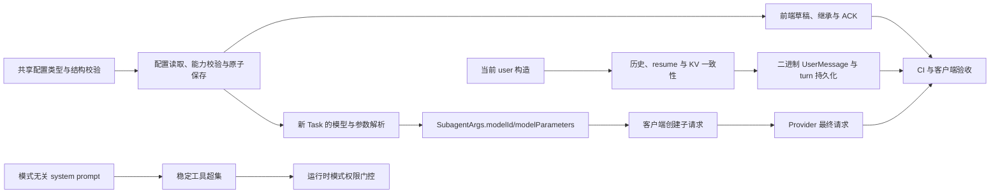

# Cursor++ IDE 快照、Prompt Cache 与 Subagent 配置实施计划

## 1. 文档状态

- 仓库：`/root/CCursor`
- 远端：`git@github.com:austinhmh/CCursor.git`
- 基线提交：`fcac85db793fc2c8cda3318b96ec5a41c24f5e26`
- Cursor++ 版本：`0.0.15`
- 详细交接资料：[AI_IMPLEMENTATION_HANDOFF.md](./AI_IMPLEMENTATION_HANDOFF.md)
- 前端效果图：[cursor-plus-subagents-ui.svg](./cursor-plus-subagents-ui.svg)
- 架构流程图：[cursor-plus-plan.svg](./cursor-plus-plan.svg)

本文是执行顺序和验收计划。所有当前源码、拟议代码、测试代码、日志证据、论坛与 OpenAI 文档依据均集中在 `AI_IMPLEMENTATION_HANDOFF.md`，后续实现者不应重新做宽范围仓库扫描。

## 2. 最终目标

本次 Cursor++ 工作包含三个相互关联、可独立验证的工作流：

1. 修复 IDE state 被放入早期 preamble 并在每轮被替换的问题。
2. 让 Agent、Plan、Ask、Debug 模式共享稳定的 system prompt 和顶层 tools schema；模式差异只追加到当前 user 尾部，并由运行时执行权限门控。
3. 增加统一的内置 Subagent 配置面板，支持统一默认和 `explore`、`generalPurpose`、`shell` 三类覆盖。

Subagent 每项配置包含：

- Cursor++ 内部 `ProviderModel.id`；
- 可选 reasoning/effort；
- Fast 三态：模型默认、显式开启、显式关闭；
- 可选 context token limit。

主 Agent、Provider 全局模型默认、各模式的实际执行权限、自定义 agent、CPA 和已有 Desktop/Glass 补丁保持不变。`CreatePlan` 等工具定义会永久保留在稳定工具超集中，但不等于所有模式都获准执行。

## 3. 不变量与非目标

### 3.1 必须保持

- 新 IDE 快照属于对应的人类 user 轮次。
- 已进入历史的旧 user 消息保持原样，不使用当前 IDE state 重写。
- 同一人类轮次的工具循环不追加第二份 user 或 IDE state。
- resume 不重复追加已经存在的当前 user；空历史恢复仍必须保留唯一 user。
- Agent、Plan、Ask、Debug 对同一模型和能力快照生成相同的 system prompt。
- Agent、Plan、Ask、Debug 对同一模型和能力快照生成相同的顶层 tools schema。
- `CreatePlan` 永久存在于工具定义中，只允许 Plan 模式执行；Agent/Ask/Debug 调用时返回明确的 `mode_mismatch`。
- Ask/Debug 原先通过删除工具实现的限制下沉到运行时，语义权限保持不变。
- 新 Subagent 面板只影响新启动或 `resume=self` 的内置 Subagent。
- 普通 `resume=<existing-agent-id>` 跳过新面板覆盖，保留现有恢复协议。
- 面板配置未创建时，保持当前 Cursor 原生 override/父模型行为。
- 已配置但模型被删除时明确报错，不静默回退到昂贵模型。
- 模型下拉保存内部 `ProviderModel.id`，不保存 `apiModel` 或显示名。
- 类型覆盖作为完整选择，不把另一模型的统一默认参数混入该类型。
- 配置损坏与配置不存在必须区分处理。

### 3.2 本次不做

- 不因为工具 schema 永久可见而扩大 Plan、Ask、Debug、readonly 的实际执行权限。
- 不删除历史 IDE 快照以换取上下文变小。
- 不承诺 rules、tools、模型切换、compaction 或 provider eviction 时仍 100% 命中缓存。
- 不自动读取或修改另一台 Mac 的 Cursor `state.vscdb`。
- 不硬编码博客中的 Luna model ID、Max、Fast 或 372000 为产品默认。
- 不在 CPA 默认解析和重排 Cursor++ 私有 XML。
- 不在本地运行构建或自动测试。

## 4. 依赖顺序

实施顺序：

1. 共享类型和配置存储。
2. IDE 快照、历史与 resume 修复。
3. system prompt、tools schema 与运行时模式权限稳定化。
4. Task/Subagent 参数闭环。
5. 前端 Subagents 面板。
6. 自动测试和 CI。
7. 目标 Mac 客户端人工验收。
8. 验收后才讨论 CPA explicit cache 增强。

## 5. 修改索引

| 文件                                                               | 操作                                          |
| ---------------------------------------------------------------- | ------------------------------------------- |
| `Cursor++/src/server/handlers/agent/protocol/messageBuilder.ts`  | 将新 IDE state 从 preamble 移到当前 user           |
| `Cursor++/src/server/handlers/agent/historyManager.ts`           | 保留 legacy preamble state；统一决定是否追加当前 user    |
| `Cursor++/src/server/handlers/agent/conversationRuntime.ts`      | KV user 发送服从 history 的追加决定                  |
| `Cursor++/src/server/handlers/agent/turnTracker.ts`              | 将 IDE state 保存进已有 binary UserMessage schema |
| `Cursor++/src/server/handlers/agent/protocol/prompts/openaiSystem.ts` | 删除 mode 条件，输出稳定 `mode_selection` |
| `Cursor++/src/server/handlers/agent/protocol/prompts/anthropicSystem.ts` | 删除 Plan/Agent 条件 system 段 |
| `Cursor++/src/server/handlers/agent/toolkit/types.ts` | 输出稳定工具超集，并定义运行时模式权限矩阵 |
| `Cursor++/src/server/handlers/agent/toolkit/definitions/CreatePlan.ts` | 更新永久定义、Plan-only 执行说明 |
| `Cursor++/src/shared/subagentConfig.ts`                          | 新增浏览器安全配置类型和结构校验                            |
| `Cursor++/src/server/config/paths.ts`                            | 新增 `~/.ccursor/subagents.json` 路径           |
| `Cursor++/src/server/config/subagentModelStore.ts`               | 新增无缓存读取、能力校验和原子保存                           |
| `Cursor++/src/server/handlers/agent/subagentModelSelection.ts`   | 新增内置类型新任务的配置解析                              |
| `Cursor++/src/server/handlers/agent/toolkit/definitions/Task.ts` | 在共同 Task builder 注入 modelId/modelParameters |
| `Cursor++/src/server/handlers/agent/toolRuntime.ts`              | 修复并发 Task 构造失败时的半截生命周期                      |
| `Cursor++/src/ui/webview/subagents.ts`                           | 新增可独立测试的前端状态控制器                             |
| `Cursor++/src/ui/components/subagents.tsx`                       | 新增统一默认和三类覆盖 UI                              |
| `Cursor++/src/ui/webview/app.ts`                                 | 接入 controller、providers 和请求 ACK             |
| `Cursor++/src/ui/panel-provider.ts`                              | 接入配置 get/save RPC                           |
| `Cursor++/src/ui/components/layout.tsx`                          | 挂载 Subagents 区域                             |
| `Cursor++/src/server/tests/protocolStep2Preamble.test.ts`        | 更新已有 IDE state 位置断言                         |
| `Cursor++/src/server/tests/modeCacheStability.test.ts` | 新增 system/tools 指纹与运行时权限门控测试 |
| `Cursor++/src/server/tests/ideSnapshot.test.ts`                  | 新增消息、历史、resume、binary turn 和权限测试            |
| `Cursor++/src/server/tests/subagentSettings.test.ts`             | 新增配置、能力、Task、protobuf、child parser 测试       |
| `Cursor++/src/server/tests/subagentPanel.test.ts`                | 新增 UI controller 测试                         |
| `Cursor++/src/server/tests/subagentProvider.test.ts`             | 新增最终 provider 参数捕获测试                        |
| `.github/workflows/ccursor-checks.yml`                           | 新增 CI 类型检查、lint、测试和构建                       |

## 6. Cursor++ 实施阶段

### 阶段 A：IDE 快照和历史

1. `buildPreambleUserMessage()` 不再调用 `buildIdeStateSection()`。
2. `buildCurrentUserTurn()` 顺序固定为：mode reminder、dynamic-tool reminder、IDE state、user query。
3. 图片仍作为当前 user 的 image block，文本 block 保留 reminder/state/query。
4. `syncConversationScaffold()` 只兼容旧 preamble 中已有的第一份 IDE state，同时继续刷新真实变化的 rules/skills/provider scaffold。
5. `rebuildConversationHistory()` 返回 `currentUserAppended`，避免 history 与 KV 通道做出不同决定。
6. resume 有历史 user 时不再追加；resume 历史为空时必须追加当前 user。
7. `createCurrentTurnUserMessageBlob()` 使用现有 `SelectedContext.invocationContext.ideState` schema，不修改 proto 和生成文件。

### 阶段 B：配置存储

1. `SubagentConfig` schemaVersion 固定为 1。
2. `getSubagentConfig()` 每次读磁盘，不新增缓存和 watcher。
3. 文件不存在返回空配置；权限、损坏 JSON、未知字段抛出明确错误。
4. `saveSubagentConfig()` 先完成结构和所有模型能力校验，再通过 `withSerial()` 与 `writeJsonAtomic()` 保存。
5. `getSubagentConfig()` 不做模型存在性校验，使 UI 能显示并修复已删除模型；保存和执行时必须校验。
6. OpenAI 使用 `parameters.reasoning`；Anthropic/Gemini 使用 `parameters.effort`。
7. Fast 只有在 `parameters.fast === true` 时可配置，但显式 `false` 必须保留。
8. context 只接受所选模型 `parameters.context` 中的候选值。

### 阶段 C：模式切换不破坏稳定前缀

1. 删除 `buildSystemPrompt()` 中 Plan-only `plan_mode_guardrails`；完整 Plan 规则继续由 `buildPlanReminder()` 放在当前 user。
2. OpenAI/Anthropic system prompt 不再根据 `parsed.mode` 增删 `mode_selection` 或 Plan 段。
3. `filterToolsForMode()` 不再根据模式删除工具，只保留 main/subagent 角色本身的稳定差异。
4. `CreatePlan`、写入工具、Task、SwitchMode 等定义在四种模式中保持相同顺序和 schema。
5. 新增 `getToolModeRestriction()`：Agent 禁止 CreatePlan；Ask 禁止写入、删除、Task、GenerateImage、SwitchMode、CreatePlan；Debug 禁止 SwitchMode、CreatePlan；Plan 保持当前完整执行集合。
6. 被禁止调用时生成完整 started/completed error 生命周期，将 `mode_mismatch` 喂回模型，并且不执行副作用。
7. 并发 Task 在 Ask 模式不进入 `launchTaskTool()`，改走统一受限错误路径。
8. 模式 reminder 仍随当前 user 改变；这是尾部新增内容，不重写此前 system、preamble 和 history。

### 阶段 D：Task/Subagent 参数闭环

1. 只对 `explore`、`generalPurpose`、`shell` 应用面板配置。
2. 普通 resume 跳过面板配置；`self` 按新任务处理。
3. `resolveConfiguredSubagent()` 返回内部 model ID 和 `{id,value}` modelParameters。
4. `Task.buildExecArgs()` 是普通 Task、并发 Task、动态包装 Task 的共同注入点。
5. LLM arguments 中的 `model`、`modelId`、`modelParameters` 不可信，不作为权威配置。
6. 无面板配置时继续使用 `toolRuntime` 已解析出的 native override/父模型。
7. child `parseRunRequest()` 继续消费现有 requestedModel 参数，不复制解析逻辑。
8. 并发 Task 在 buildExecArgs 失败时不能只返回 `null`；必须避免只发 started 而没有 completed/exec 的半截生命周期。

### 阶段 E：前端

1. Subagents 区域放在 Providers 之后。
2. 第一行是统一默认；三类行默认显示“使用统一默认”。
3. 模型选项格式：`Provider name / model displayName`，值为 `ProviderModel.id`。
4. reasoning 和 context 只显示所选模型声明的候选项。
5. Fast 是三态 select，不使用二态 checkbox。
6. 更换模型时清空旧 reasoning/Fast/context，避免跨模型残留不兼容参数。
7. 保存期间禁止编辑和重复提交。
8. 只有后端返回匹配 requestId 的 ACK 后才显示已保存。
9. 保存失败保留草稿和原 committed 值。
10. 已删除模型仍显示为 `Missing model` 以便用户修复。

## 7. 自动测试

### 7.1 IDE 与历史

- 新 preamble 不含 IDE state；当前 user 正好包含一份。
- IDE state 为空时不输出空 XML。
- user 图片、query、mode reminder 不变。
- 两个用户轮次保留各自 snapshot；第一轮内容不被第二轮替换。
- 同一轮多个工具调用不增加 user 数量或 state 数量。
- resume 有历史时不追加；空历史时追加唯一 user。
- legacy preamble state 只保留一份，重复恢复幂等；rules 仍可更新。
- ordinary blob、binary UserMessage、turn reference、checkpoint 经重新加载保持一致。
- Agent、Plan、Ask、Debug、readonly 工具权限不变。
- 四种模式的 system prompt 完全相同。
- 四种模式的顶层 tools JSON 完全相同，均含 `CreatePlan` 和 `SwitchMode`。
- 模式切换只改变当前 user reminder；旧 system、preamble、历史 user 不变。
- Agent/Ask/Debug 调用 `CreatePlan` 返回 `mode_mismatch`，Plan 调用仍进入交互握手。
- Ask 模式调用写入、Task 或 GenerateImage 均被运行时拒绝，不执行副作用。
- Debug 模式调用 SwitchMode/CreatePlan 被拒绝。

### 7.2 配置和 Task

- 配置不存在、损坏 JSON、未知字段、非法类型分别测试。
- 模型删除后配置仍可读取，保存和执行会明确报错。
- reasoning 轴按 provider 校验。
- Fast 未设置/true/false 三态全部测试。
- context 仅允许模型候选。
- 并发全量保存后文件仍为完整 JSON。
- 类型覆盖不继承统一默认的其他模型参数。
- 无配置、custom type、普通 resume 维持原行为；self-fork 应用配置。
- SubagentArgs protobuf 保留 modelId 和 modelParameters。
- child parser 正确解析 reasoning、Fast false 和 context。
- 最终 provider 请求中的 model、reasoning/effort、service tier 符合配置。
- 主 Agent 请求完全不受影响。

### 7.3 UI

- 同名 apiModel 的不同 Provider 使用内部 ID 区分。
- 类型继承不复制默认值；默认变化会更新继承行摘要。
- 独立覆盖与统一默认互不污染。
- 更换模型清空旧参数。
- Fast 三态完整。
- 错误 requestId ACK 被忽略。
- 保存中禁止编辑；失败保留草稿；成功后 committed 与 draft 一致。
- Cancel 恢复 committed；损坏配置不制造空的已保存设置。

## 8. CI

新增 `.github/workflows/ccursor-checks.yml`，只执行：

1. `pnpm install --frozen-lockfile`；
2. `pnpm run check-types`；
3. `pnpm run lint`；
4. 聚焦 Vitest；
5. `pnpm run test:server`；
6. `pnpm run package`；
7. 上传 `Cursor++/dist` 为 Linux 验证 artifact。

不在本地运行 build/test。Linux artifact 不直接安装到 Mac，不自动发布 release。

## 9. 目标 Mac 人工验收

1. 记录 Cursor/Cursor++ 版本并备份扩展、providers、routes、Desktop/Glass 定制。
2. 配置统一默认与至少一个类型覆盖。
3. 测试三类内置 Subagent 的前台、后台、新任务、self-fork、普通 resume。
4. 同时观察 SubagentArgs、child requestedModel 与最终 provider 请求。
5. 若客户端忽略 modelParameters，阻止发布，不能宣称仅服务端改动已生效。
6. 切换可见文件，确认早期 system/preamble 不因 IDE state 变化而改变。
7. 同一人类轮次执行多个工具，确认只存在一条 user snapshot。
8. 四种模式的 system/tools 指纹保持一致，实际执行权限由运行时门控保持原有行为。
9. 固定 provider、模型、账号，比较真实 `cached_tokens`；记录 compaction/rules/tools 变化。

## 10. CPA 后续阶段

Cursor++ 消息结构稳定并验收后，CPA 才考虑：

- native `/responses` 独立 prompt-cache capability；
- `prompt_cache_options` 与 explicit breakpoint 的 opt-in 透传；
- upstream key 的 envelope profile 分区；
- Codex 路径继续移除不支持字段。

CPA 不能代替 Cursor++ 修复动态早期前缀，也不能默认重排私有 XML。详细建议见 handoff 文档。

## 11. 完成定义

- [ ] 所有业务代码按 handoff 中的目标代码实施。
- [ ] 所有旧测试根据新消息归属更新，不通过删除测试规避失败。
- [ ] 新聚焦测试在 CI 通过。
- [ ] 全量测试、类型检查、lint、扩展构建在 CI 通过。
- [ ] 目标 Mac 端完成真实 Subagent 参数链和缓存验证。
- [ ] 源码完成、CI 完成、Mac 验收分别报告。
- [ ] 未经授权不修改 CPA、不安装、不发布、不 force push。
